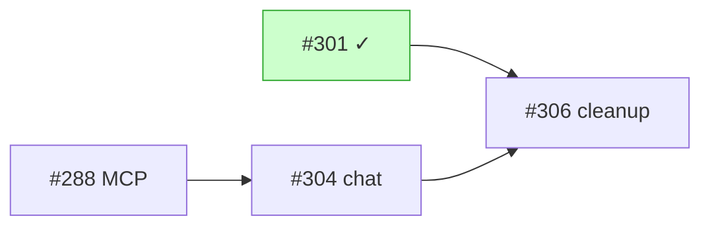

# plan-dag

Render the current plan as a dependency DAG so sequencing, the critical path, and parallelizable work are visible at a glance. Default output is monospace text using Unicode box-drawing glyphs (`─`, `►`, `┐ ├ ┤ └`) so it lands cleanly in chat, terminals, and PR descriptions.

## When to use

- After a `what's next` survey, to commit to a sequence.
- When asked "what's left for #N" on an umbrella spec with sub-issues.
- Before picking the next branch — to see what unblocks the most downstream work.
- When a spec fans out into N sub-issues and the dependency edges aren't all linear.

Skip when:

- A single-PR spec — the plan *is* the Plan section, not a DAG.
- An unanswered design question — drawing a DAG before alignment is theater.
- The "graph" is one linear chain of three or fewer nodes — a sentence is shorter than a diagram.

## Inputs

| Parameter | Default |
|-----------|---------|
| **Scope** | Inferred — current branch's spec, the umbrella the user named, or the open issues just surveyed. |
| **Granularity** | Spec-level; drop to sub-issue / PR level for an umbrella that has fanned out. |
| **Output format** | Monospace text (Unicode box-drawing). Add a mermaid block on top of it only when the user is going to paste the plan elsewhere. |

## Workflow

```
1. Discover    Pull issues / sub-issues / PRs in scope
2. Classify    Mark each node done / in-progress / open
3. Edge-build  Read dependencies from sub-issue links + body prose
4. Render      Group by track; cross-edges last; critical path callout
```

### 1. Discover

Resolve the scope from the conversation, not from a generic crawl. Typical triggers:

- An umbrella spec → walk its sub-issue list (`mcp__github__issue_read` with `method: get_sub_issues`).
- A track of follow-ups from a recent merge → use the priority + area filter the user implied.
- The set of issues just surveyed → reuse that list verbatim, don't refetch.

For each node, capture:

- Issue state (`open` / `closed`) and `state_reason` (`completed` vs other).
- Status labels (`in-progress`, `planned`, `draft`) and `priority:*`.
- Linked PRs — look for "merged in PR #N" in the body or comments.
- Sub-issue list (only for umbrella nodes).

### 2. Classify

Each node gets exactly one marker:

| State | Marker | Definition |
|-------|--------|------------|
| Done | `✓` | Closed + `state_reason: completed`, or merged PR. |
| In-progress | `…` | Open + `in-progress` label, or an open PR exists for it. |
| Open | _(none)_ | Open + `planned` / `draft`, no PR. |

Don't render "blocked" as a separate marker — the inbound edge to a non-done node already shows it. The marker is for the reader's eye, not the graph topology.

### 3. Edge-build

Edges come from three sources, in this order of trust. **Don't draw an edge you can't cite from one of these** — speculation pollutes the DAG.

1. **Sub-issue links** (`mcp__github__issue_read` + `method: get_sub_issues`). Edge direction is **child → parent** (prerequisite → dependent) — the parent closes when its children close, so the DAG flows toward closure.
2. **Explicit prose** in issue body: `Depends on #N`, `Hard depends on #N`, `Blocks #N`, `Part of #N`, `Closes #N`.
3. **PR/commit references**: `merged in PR #N`, `closed by #N`, `PR-A → PR-B` ordering inside an umbrella spec's Plan.

If a dependency is "obvious to me but uncited", the node label can hint at it; the edge stays out.

### 4. Render

Rendering conventions (proven shape — match this exactly so output is consistent across sessions):

- One block per **track**: an umbrella spec, an independent thread, or the "landed prereqs" group.
- Track header: short title, optional `(status)` parenthetical, underline of 3+ box-drawing dashes (`─`).
- Done nodes: inline at the top of the track if dense; one-per-line when the chain matters for ordering.
- Edges: `──►`. Branching uses line-art `┐ ├ ┤ └`. Keep edges horizontal; vertical drops are fine but avoid diagonals.
- Cross-track edges in a final **"Cross-edges"** block — don't tangle the track diagrams with each other.
- Final line: **critical path** as `A → B → close`, the longest open chain that ends in spec closure or a user-visible outcome.

Template:

```
Track name (status)
───────────────────
  ✓ #N1 short label
  ✓ #N2 short label ─┐
                     ├──► [#N4 open label] ──► closes #parent
  ✓ #N3 short label ─┘

Cross-edges
───────────
  #X ── hard-dep ──► #Y (status)

Critical path: #X → #Y → close
```

Token-frugal: one or two words per node label, the issue number does the linking. The reader can click the number; don't restate the issue title.

### Mermaid (optional second view)

Add a `mermaid` fenced block **only** when the user signals they're going to paste the plan elsewhere ("for the PR", "into Notion", "for the doc"). GitHub issue bodies, PR descriptions, and most note tools render mermaid; terminals do not — that's why monospace text is the default, not the fallback.



## Conventions

- **No invented edges.** If you can't cite the source (sub-issue link, body prose, PR header), don't draw it.
- **Summarize done nodes when dense.** More than ~3 done nodes in a track? Collapse to `Landed: #A #B #C ✓` rather than enumerating.
- **One DAG per response.** Don't render the same plan twice under different framings — pick the framing that answers the question that was actually asked.
- **End with the picked path.** A DAG without a recommended sequence is a wall of boxes. Close with the critical path and the next pickable node, framed so the user can redirect.
- **Don't editorialize inside the diagram.** Commentary ("this looks risky", "we should reorder") goes in prose above or below, never inside a node label.

## References

| Reference | When to read |
|-----------|--------------|
| `onsager-dev-process` | The SDD loop the DAG visualizes — parent / child / depends-on semantics. |
| `issue-spec` § "Spec Relationships via Sub-Issues" | How parent / child / depends-on edges are persisted on GitHub. |
| `onsager-pr-lifecycle` | How "in-progress" status flips on PR open / merge — drives the `…` marker. |
