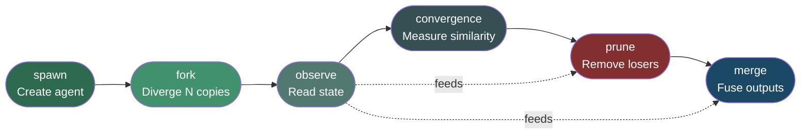
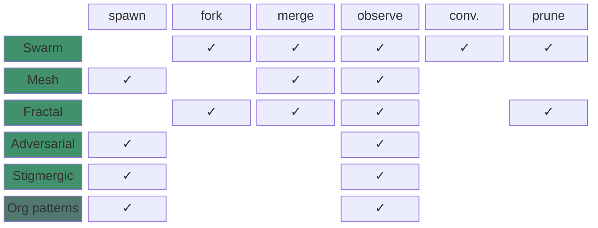
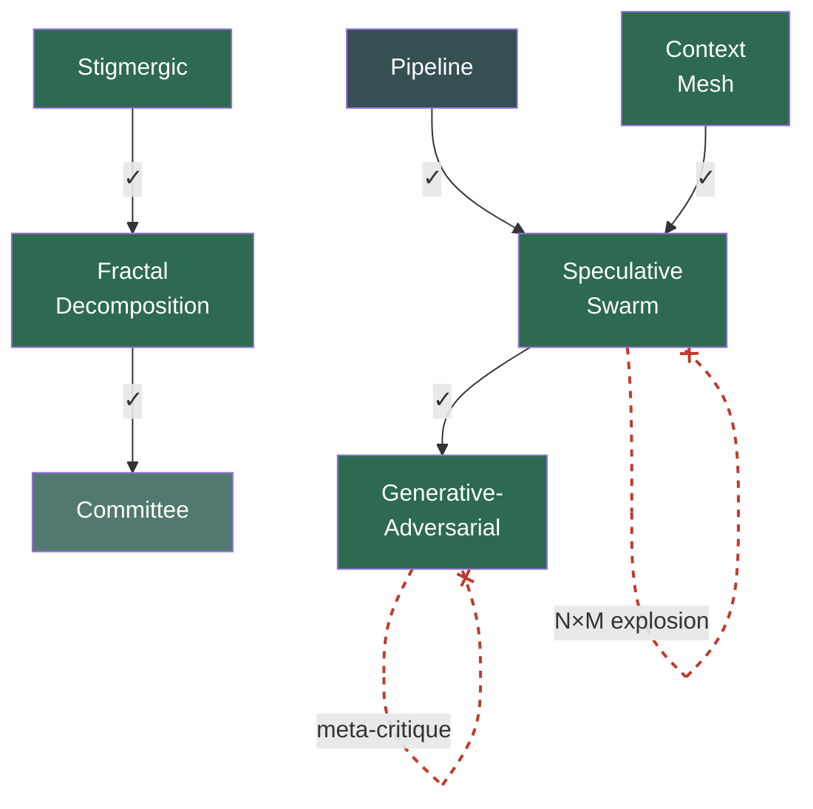
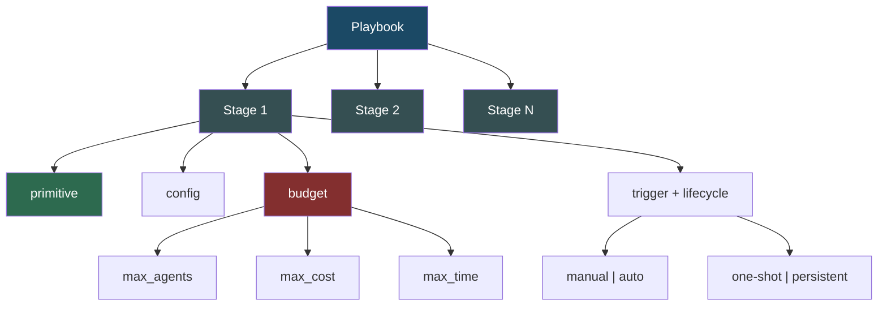
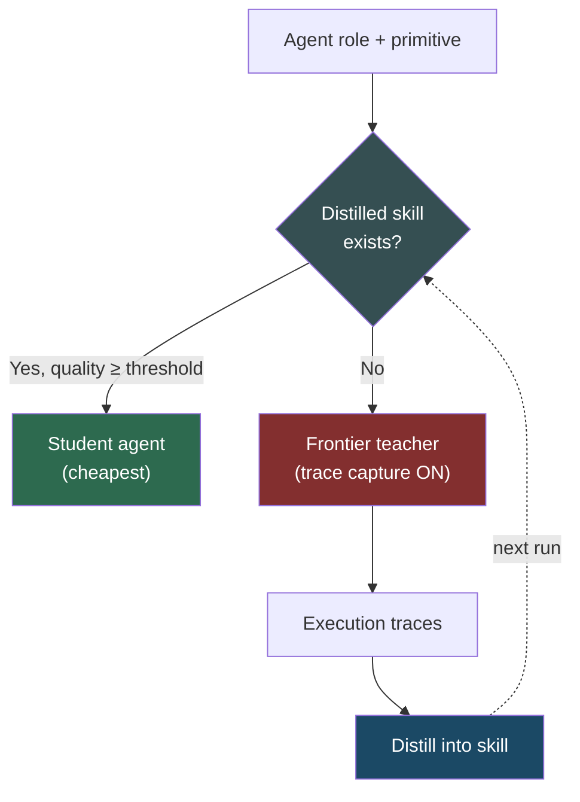

# AI-Native Coordination Model

An implementation-agnostic specification for AI agent fleet coordination, defined as JSON Schema.

## When to use this skill

- Designing a multi-agent coordination workflow
- Choosing which coordination primitive fits a problem
- Writing or validating a playbook configuration
- Checking whether a runtime conforms to the model
- Composing primitives (nesting inner/outer patterns)

## Quick reference

### The six abstract operations

Every coordination pattern is built from exactly these six operations:

| Operation | Signature | Purpose |
|---|---|---|
| `spawn` | `(template, context) → agent_id` | Create a new agent from a template |
| `fork` | `(agent_id, variants) → [agent_id]` | Clone an agent into N divergent copies |
| `merge` | `(agent_ids, strategy) → agent_id` | Combine multiple agents' outputs |
| `observe` | `(agent_id) → agent_state` | Inspect an agent's full internal state |
| `convergence` | `(agent_ids, threshold) → convergence_result` | Measure output similarity across agents |
| `prune` | `(agent_ids, criterion) → [pruned_ids]` | Remove non-contributing agents |

#### Operation lifecycle

Operations form a natural flow — creation on the left, reduction on the right, observation throughout:



### Coordination primitives

**AI-native (Category B)** — exploit properties unique to AI agents:

| Primitive | Operations used | Key idea |
|---|---|---|
| Speculative swarm | fork, observe, convergence, prune, merge | Fork N strategies, cross-pollinate, prune redundant, fuse best fragments |
| Context mesh | spawn, observe, merge | Shared knowledge DAG with reactive gap-filling |
| Fractal decomposition | fork, observe, merge, prune | Agent splits itself into scoped sub-agents, recursively |
| Generative-adversarial | spawn, observe | Generator vs critic in escalating quality loop |
| Stigmergic | observe, spawn | Agents coordinate through shared artifact changes |

**Organizational (Category A)** — map human patterns onto agent fleets:

| Pattern | Operations used |
|---|---|
| Hierarchical | spawn, observe |
| Pipeline | spawn |
| Committee | spawn, observe |
| Departmental | spawn, observe |
| Marketplace | spawn |
| Matrix | spawn, observe |

### Primitive–operation matrix

Which operations each primitive uses — AI-native primitives use more of the operation set:



### Composability

Primitives nest. The outer stage runs the inner stage within its own execution.

**Known good compositions:**

| Outer → Inner | Result |
|---|---|
| Pipeline → Speculative swarm | Each stage explores strategies independently |
| Stigmergic → Fractal decomposition | Artifact changes trigger self-splitting |
| Speculative swarm → Generative-adversarial | Each branch adversarially hardened before fusion |
| Context mesh → Speculative swarm | Gap detection triggers swarm exploration |
| Fractal decomposition → Committee | Children deliberate before reunifying |

**Anti-patterns (never compose):**

| Composition | Why it fails |
|---|---|
| Swarm → Swarm | N×M exponential agent count |
| Adversarial → Adversarial | Meta-critique without grounding |
| Stigmergic (no debounce) | Reaction storm |

#### Composability map

Green arrows = valid compositions. Red dashed = anti-patterns.



## Schema files

All schemas follow JSON Schema Draft 2020-12. Use them to validate configurations:

- [operations.schema.json](references/operations.schema.json) — Operation signatures and types
- [primitives.schema.json](references/primitives.schema.json) — Per-primitive config surfaces with field constraints
- [playbook.schema.json](references/playbook.schema.json) — Declarative playbook format with stages, budgets, composition rules
- [conformance.schema.json](references/conformance.schema.json) — Runtime capability declaration (MUST/MAY)

## Playbook structure

A playbook is a sequence of stages, each applying one coordination primitive:



## Writing a playbook

A playbook declares what coordination to apply. Example for the "Explore-Harden-Maintain" pattern:

```yaml
playbook:
  name: explore-harden-maintain
  domain: artifact-production
  description: Divergent creation, adversarial hardening, continuous maintenance
  stages:
    - name: explore
      primitive: speculative-swarm
      config:
        strategies: ["breadth-first", "depth-first", "lateral", "contrarian"]
        checkpoint_interval: "5m"
        convergence_threshold: 0.7
        merge_strategy: fragment-fusion
        budget:
          max_agents: 8
          max_cost: 100
          max_time: "30m"
      trigger: manual
      lifecycle: one-shot
      budget:
        max_agents: 8
        max_cost: 100
        max_time: "30m"

    - name: harden
      primitive: generative-adversarial
      config:
        escalation_modes: ["surface-scan", "edge-cases", "adversarial-inputs", "semantic-analysis"]
        max_rounds: 6
        termination:
          consecutive_clean_rounds: 2
          quality_threshold: 0.9
        progressive_difficulty: true
      trigger: auto
      lifecycle: one-shot
      budget:
        max_agents: 2
        max_cost: 50
        max_time: "20m"

    - name: maintain
      primitive: stigmergic
      config:
        agent_subscriptions:
          - watch_pattern: "artifacts/**"
            production_target: "patches/"
        marker_types: ["needs-review", "stale", "confidence"]
        marker_decay: "1h"
        reaction_debounce: "30s"
      trigger: auto
      lifecycle: persistent
      budget:
        max_agents: 5
        max_cost: 200
        max_time: "24h"
```

Validate with: `python scripts/validate.py playbook.yaml`

## Validating a playbook

Run the bundled validation script against any playbook YAML/JSON:

```bash
python scripts/validate.py my-playbook.yaml
```

This checks:
- Valid YAML/JSON structure
- All `primitive` values are from the defined enum
- Config fields match the primitive's schema surface
- Budget blocks are present and well-formed
- No known anti-pattern compositions

## Declaring runtime conformance

A runtime declares conformance by producing a `conformance.json`:

```json
{
  "runtime": {
    "name": "clawden",
    "version": "0.1.0",
    "must": {
      "abstract_operations": {
        "spawn": true,
        "fork": true,
        "merge": true,
        "observe": true,
        "convergence": true,
        "prune": true
      },
      "dynamic_lifecycle": true,
      "state_observability": true,
      "budget_enforcement": true,
      "composable_patterns": true,
      "trace_capture": true,
      "declarative_playbooks": true
    },
    "may": {
      "distributed_execution": false,
      "persistent_state": true,
      "hot_swap_patterns": false
    }
  }
}
```

Validate with: `python scripts/validate.py --schema conformance conformance.json`

## Cost optimization model

Most fleet work is repetitive pattern execution, not novel reasoning. The model routes agents to the cheapest sufficient tier:



Three tiers: **Frontier** (novel reasoning, highest cost), **Mid-tier** (balanced), **Student** (distilled pattern replay, 50–90% cheaper). The traces from frontier runs become training data for future student skills.

## Cost optimization model

Most fleet work is repetitive pattern execution, not novel reasoning. The model defines three tiers:

- **Frontier** — novel reasoning, creative exploration (highest cost)
- **Mid-tier** — moderate complexity (balanced)
- **Student** — pattern replay with distilled skills (lowest cost)

A scheduler checks for a matching distilled `(role, primitive)` skill. If one exists with sufficient quality, use a student agent. If not, use a frontier teacher with trace capture enabled. This produces 50–90% cost reduction across primitives without changing the coordination logic.
