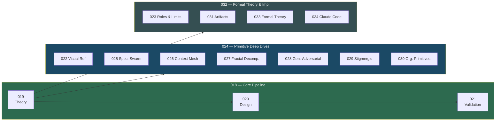

# AI-Native Agent Coordination Model

## Overview

This umbrella spec produces a **machine-validatable specification** for AI agent fleet coordination — the operations, primitives, composition rules, and conformance requirements that any agent orchestration framework can implement.

The deliverable is an **Agent Skill** (`coordination-model/`) containing JSON Schema files that define the model. The schemas are the specification — not prose, not code, not a wire protocol. Any runtime in any language can validate its playbooks and conformance declarations against them.

The ClawDen implementation of this model lives in specs 012–016 under the 002 umbrella. Other frameworks can implement independently by validating against the same schemas.

## Design

This umbrella coordinates three groups, each containing multiple child specs:

### Group A: Core Specification Pipeline (018)

The critical path — sequential from theory through validation:

| Child                                            | Purpose                                                                                                                                               |
| ------------------------------------------------ | ----------------------------------------------------------------------------------------------------------------------------------------------------- |
| `019-coordination-model-theory`                  | Why AI-native coordination differs from human patterns. Defines 6 abstract operations, 11 primitives, composability rules, anti-patterns, cost model. |
| `020-coordination-model-design`                  | JSON Schema artifacts: operations, primitives, playbook, conformance schemas. SKILL.md agent guidance. validate.py script.                            |
| `021-coordination-model-validation-distribution` | Test fixtures, schema cross-consistency audit, `.skill` packaging, schema URL repository.                                                             |

### Group B: Primitive Deep Dives (024)

Per-primitive analysis and reference material — parallelizable once theory (019) is complete:

| Child                                            | Purpose                                                                                                                                               |
| ------------------------------------------------ | ----------------------------------------------------------------------------------------------------------------------------------------------------- |
| `022-coordination-primitives-visual-reference`   | Visual diagrams of all 11 primitives — agent flow, operations used, key structural insight per primitive.                                             |
| `025-speculative-swarm-primitive`                | Deep dive: operation lifecycle, config surface, merge strategies, composability, failure modes for the speculative swarm primitive.                    |
| `026-context-mesh-primitive`                     | Deep dive: knowledge DAG structure, gap detection, conflict resolution, reactive propagation for the context mesh primitive.                          |
| `027-fractal-decomposition-primitive`            | Deep dive: scope isolation, recursive splitting, reunification strategies, depth management for the fractal decomposition primitive.                  |
| `028-generative-adversarial-primitive`           | Deep dive: escalation ladder, generator-critic contract, termination conditions for the generative-adversarial primitive.                             |
| `029-stigmergic-coordination-primitive`          | Deep dive: pheromone markers, debounce requirement, O(artifacts) cost model, emergent workflow for the stigmergic primitive.                          |
| `030-organizational-coordination-primitives`     | Deep dive: all 6 Category A primitives (hierarchical, pipeline, committee, departmental, marketplace, matrix) — config, failure modes, cross-category composition. |

### Group C: Formal Theory & Implementation Mapping (032)

Cross-cutting foundations and concrete implementation binding:

| Child                                            | Purpose                                                                                                                                               |
| ------------------------------------------------ | ----------------------------------------------------------------------------------------------------------------------------------------------------- |
| `023-coordination-model-roles-limitations`       | Dual roles (knowledge navigation vs action orchestration), out-of-scope boundaries, scaling limits & mitigations.                                     |
| `031-coordination-artifact-model`                | Formal artifact definition: properties, kinds, versioning, fragment model, lifecycle state machine, per-primitive artifact roles, addressing schemes.              |
| `033-coordination-model-formal-theory`           | Mathematical formalization: set-theoretic foundations, coordination algebra, axioms (costless cloning, lossless observation, fatigue invariance), composability theorems, cost calculus, falsifiable experimental predictions. |
| `034-claude-code-coordination-implementation`    | Mapping spec 019 operations and primitives to Claude Code's agentic runtime — operation fidelity, subagent orchestration patterns, ClawDen integration points, cost model mapping.                                          |

Implementation order: Group A is sequential (019 → 020 → 021). Groups B and C can proceed in parallel once 019 is complete.



## Plan

- [ ] Complete spec 019 to establish the conceptual model
- [ ] Complete spec 020 to encode the model as JSON Schema + agent skill
- [ ] Complete spec 021 to validate schemas with fixtures and distribute

## Test

- [ ] All 3 child specs are complete
- [ ] Schema artifacts validate against JSON Schema Draft 2020-12
- [ ] All test fixtures pass/fail as expected
- [ ] Schema cross-consistency checks pass (enum alignment between schemas)

```bash
python -c "
import json
p = json.load(open('references/playbook.schema.json'))
r = json.load(open('references/primitives.schema.json'))
playbook_prims = set(p['\$defs']['stage']['properties']['primitive']['enum'])
prims_prims = set(r['properties']['primitive']['enum'])
assert playbook_prims == prims_prims, f'Mismatch: {playbook_prims ^ prims_prims}'
print('OK: primitive enums match')
"
```

| Assertion     | Deterministic check |
| ------------- | ------------------- |
| `enums-match` | No AssertionError   |

## Notes

The schemas are intentionally free of programming language, wire format, storage backend, and LLM provider references. The `$id` URLs are placeholders until the schema repo ships.

The ClawDen implementation (specs 012–016) translates this abstract model into concrete Rust traits, AgentEnvelope wire protocol, SQLite persistence, and `clawden.yaml` configuration.