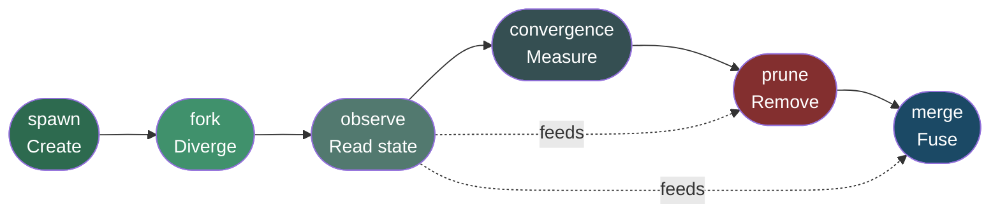
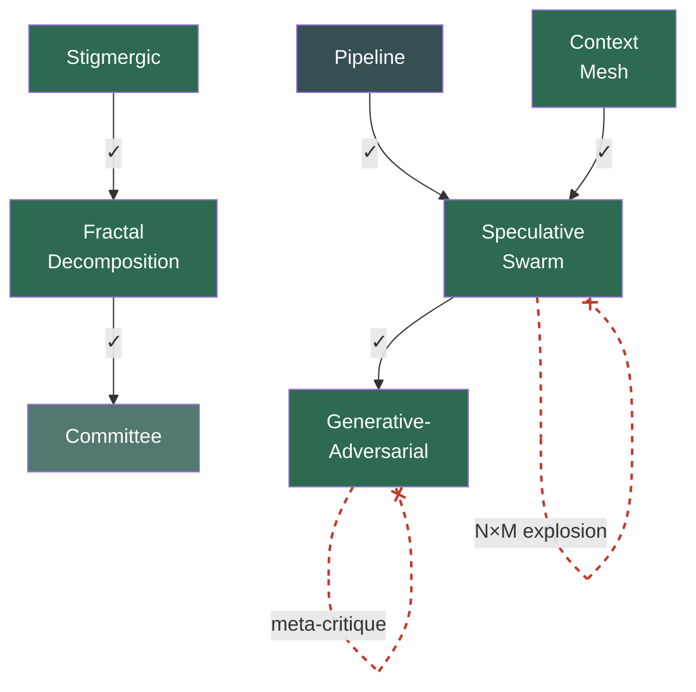
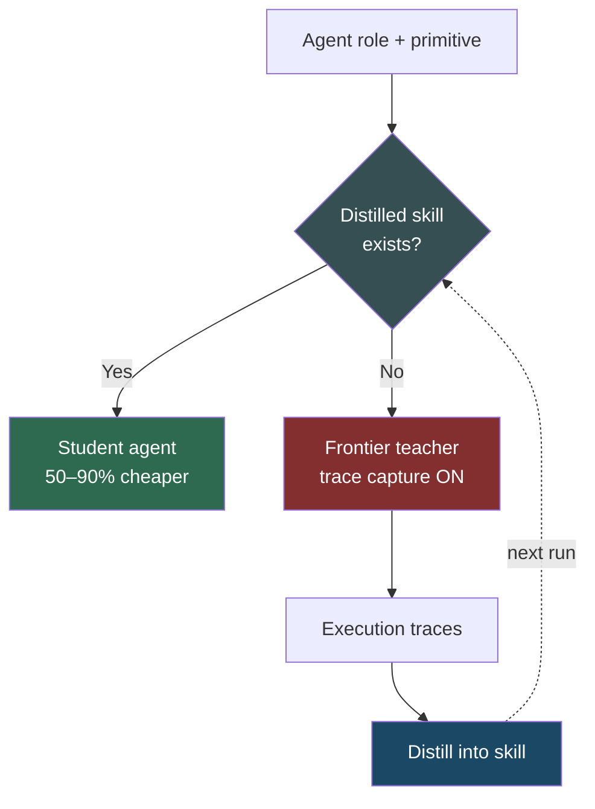

# Coordination Model Theory — Abstract Operations, Primitives & Composability

## Overview

Defines the conceptual foundation of the AI-native coordination model: **why** AI agent coordination differs from human org-chart patterns, the six abstract operations, eleven coordination primitives, composability rules, anti-patterns, and the cost optimization model.

This is the "what and why" layer — no schemas, no code, no fixtures. Those live in sibling specs 020 (design) and 021 (validation & distribution).

For visual diagrams of all 11 primitives showing agent flow and operations used, see spec 022 (coordination primitives visual reference).

## Design

### Why AI-native coordination?

Human coordination patterns (hierarchy, pipeline, committee) exist because humans can't be cloned, communicate lossily, and tire. AI agents have none of these constraints:

- **Zero fork cost** — cloning an agent is instant and cheap
- **Lossless context transfer** — full state can be shared without information loss
- **No fatigue** — agents don't degrade over time
- **Speculative parallelism** — agents can explore mutually exclusive strategies simultaneously

These properties enable fundamentally different primitives that produce outcomes impossible with human teams. Rather than bolt AI agents onto org charts designed around human bottlenecks, the model starts from what agents *can* do and derives coordination patterns from first principles.

### Why exactly six operations?

The six operations are the minimal complete set for fleet coordination. Each one is irreducible — removing any one makes at least one primitive inexpressible:

| Operation     | Signature                                     | Why it can't be removed                                                                                                                                                                          |
| ------------- | --------------------------------------------- | ------------------------------------------------------------------------------------------------------------------------------------------------------------------------------------------------ |
| `spawn`       | `(template, context) → agent_id`              | Without creation, no fleet exists. Every pattern needs at least one agent.                                                                                                                       |
| `fork`        | `(agent_id, variants) → [agent_id]`           | Without divergent cloning, speculative exploration is impossible — you'd need to spawn blind copies without the parent's accumulated context.                                                    |
| `merge`       | `(agent_ids, strategy) → agent_id`            | Without recombination, parallel work can never reunify. Swarm, mesh, and fractal patterns all require fusing outputs into a coherent result.                                                     |
| `observe`     | `(agent_id) → agent_state`                    | Without state inspection, no pattern can make adaptive decisions. Convergence measurement, pruning criteria, and adversarial critique all depend on reading agent state.                         |
| `convergence` | `(agent_ids, threshold) → convergence_result` | Without similarity measurement, swarms can't detect when branches have reached agreement and should stop exploring. Distinct from `observe` because it compares *across* agents, not within one. |
| `prune`       | `(agent_ids, criterion) → [pruned_ids]`       | Without removal, resource usage grows monotonically. Any pattern that forks or spawns speculatively needs a way to reclaim agents that aren't contributing.                                      |

Conversely, these six are sufficient: every primitive's behavior can be expressed as a sequence of these operations, as shown in the operations-used column below.

### Why two categories of primitives?

**Category A (Organizational)** patterns exist because they map to coordination structures people already understand. They're the starting point for teams transitioning from human-only workflows to agent fleets — familiar mental models with immediate productivity gains. They only use `spawn` and `observe` because they don't exploit agent-specific properties, but they remain the right choice when the problem *is* structured like a human org.

| Pattern      | Operations used | Structure                           | When to use                                                                                         |
| ------------ | --------------- | ----------------------------------- | --------------------------------------------------------------------------------------------------- |
| Hierarchical | spawn, observe  | Manager delegates to workers        | Clear authority, well-scoped subtasks, results roll up. The default when team structure is obvious. |
| Pipeline     | spawn           | Sequential stages, output → input   | Work has a natural order (draft → review → polish). Each stage is independent.                      |
| Committee    | spawn, observe  | Peers deliberate, vote on outcome   | Decisions benefit from diverse perspectives. No single agent has sufficient context alone.          |
| Departmental | spawn, observe  | Functional groups, cross-group sync | Problem splits along domain boundaries (frontend/backend, legal/engineering).                       |
| Marketplace  | spawn           | Tasks posted, agents bid/claim      | Heterogeneous agent capabilities, dynamic task assignment, load balancing across specialists.       |
| Matrix       | spawn, observe  | Dual reporting — function + project | Agents serve both a functional specialty and a project goal simultaneously.                         |

Category A patterns are **not deprecated** — they're the foundation. Many real workflows are best served by a pipeline or committee. The AI-native primitives below extend the toolkit for problems where human-shaped coordination leaves performance on the table.

**Category B (AI-native)** patterns exist because agents can do things humans can't. Each one exploits a specific agent property that has no human equivalent:

| Primitive              | Operations used                          | Agent property exploited                 | What it enables that humans can't do                                                                                                                                                                                                                |
| ---------------------- | ---------------------------------------- | ---------------------------------------- | --------------------------------------------------------------------------------------------------------------------------------------------------------------------------------------------------------------------------------------------------- |
| Speculative swarm      | fork, observe, convergence, prune, merge | Zero fork cost + speculative parallelism | Explore N mutually exclusive strategies *simultaneously*, cross-pollinate insights between branches, prune losers, fuse the best fragments into a result no single branch could produce. A human team can't cheaply clone a researcher mid-thought. |
| Context mesh           | spawn, observe, merge                    | Lossless context transfer                | Build a shared knowledge DAG where any agent's discovery is instantly available to all others. Knowledge gaps trigger reactive spawning. Humans lose information at every handoff.                                                                  |
| Fractal decomposition  | fork, observe, merge, prune              | Zero fork cost + self-similarity         | An agent splits itself into scoped sub-agents recursively — like cell division. The sub-agents inherit full context and specialize. Humans can't clone themselves mid-task with full memory.                                                        |
| Generative-adversarial | spawn, observe                           | No fatigue + lossless critique           | Generator and critic agents escalate quality in a tight loop without tiring or becoming defensive. Human review degrades after a few rounds; agents maintain consistent quality indefinitely.                                                       |
| Stigmergic             | observe, spawn                           | Environment as communication             | Agents coordinate purely through shared artifact changes — like ants leaving pheromone trails. No explicit messaging needed. Scales to large fleets because coordination cost is O(artifacts), not O(agents²).                                      |

### Why these composability rules?

Primitives compose by nesting: the outer stage runs the inner within its own execution. Not all compositions are valid.

**Good compositions work when the inner pattern solves a sub-problem the outer pattern creates:**

| Outer → Inner                              | Why it works                                                                                                                  |
| ------------------------------------------ | ----------------------------------------------------------------------------------------------------------------------------- |
| Pipeline → Speculative swarm               | Each pipeline stage is an independent problem; swarming within a stage doesn't affect other stages.                           |
| Stigmergic → Fractal decomposition         | An artifact change creates a sub-problem; fractal decomposition is a natural way to attack a scoped sub-problem.              |
| Speculative swarm → Generative-adversarial | Each swarm branch produces a candidate; adversarial hardening strengthens each candidate before the merge selects among them. |
| Context mesh → Speculative swarm           | A knowledge gap is a sub-problem; swarming it explores multiple resolution strategies.                                        |
| Fractal decomposition → Committee          | Each fractal child handles a scoped piece; committee deliberation within that scope produces better sub-results.              |

**Anti-patterns fail for structural reasons:**

| Composition               | Why it fails                                                                                                                                           |
| ------------------------- | ------------------------------------------------------------------------------------------------------------------------------------------------------ |
| Swarm → Swarm             | Each of N outer branches spawns M inner branches → N×M agents. Cost and coordination overhead grow multiplicatively with no convergence guarantee.     |
| Adversarial → Adversarial | The inner critic criticizes the outer critic — meta-critique without grounded production. Neither layer produces artifacts, only objections.           |
| Stigmergic (no debounce)  | Agent A's artifact change triggers Agent B, whose change triggers Agent A → unbounded reaction storm. Debounce is structurally required, not optional. |

### Why a cost model belongs in the theory

Coordination patterns determine cost structure. A speculative swarm with 8 frontier-model agents costs 8× a single agent. But most fleet work is *repetitive pattern execution* — the 4th time you run a swarm for code review, the strategies and merge heuristics are predictable.

The cost model defines three tiers — Frontier (novel reasoning), Mid-tier (balanced), Student (distilled pattern replay) — and a routing rule: if a distilled `(role, primitive)` skill exists with sufficient quality, use a student agent; otherwise use a frontier teacher with trace capture enabled. The traces from the teacher run become training data for future student skills.

This belongs in the theory (not implementation) because it's a property of the coordination model itself: any runtime implementing these primitives faces the same cost structure and benefits from the same optimization. The 50–90% cost reduction comes from the *pattern*, not from any particular runtime's implementation.

## Plan

- [x] Define the six abstract operations with typed signatures
- [x] Define the eleven primitives with operations-used mappings
- [x] Document composability rules and anti-patterns
- [x] Define cost optimization model (teacher-student tiers)

## Test

- [ ] Every primitive's `operations_used` maps to a valid subset of the six operations
- [ ] Anti-pattern list covers all known degenerate compositions
- [ ] Cost model tiers are exhaustive (every agent role maps to exactly one tier)