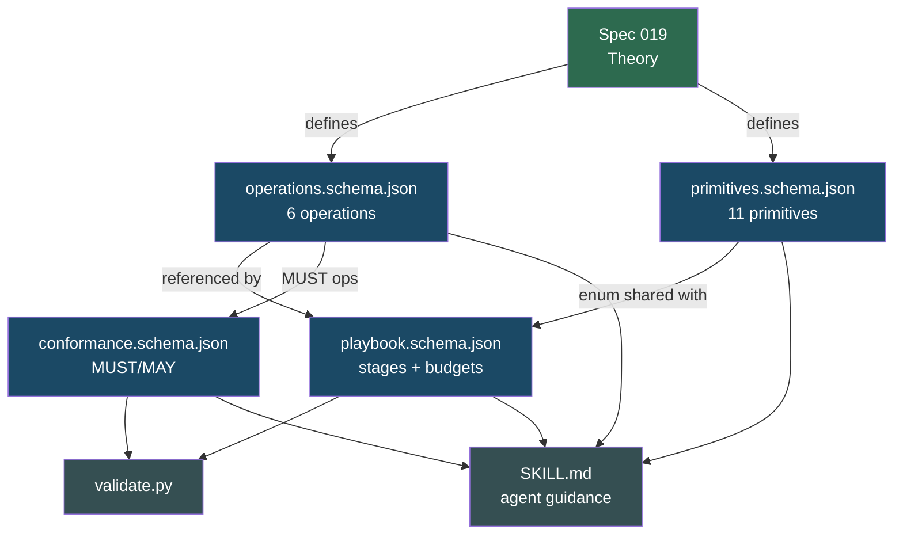

# Coordination Model Design — JSON Schema Definitions & Agent Skill

## Overview

Translates the abstract model (spec 019) into machine-validatable JSON Schema artifacts and a distributable Agent Skill. This is the "how it's specified" layer.

### Deliverable: Agent Skill

```
skill/coordination-model/
├── SKILL.md                                  # Agent guidance with quick reference
├── references/
│   ├── operations.schema.json                # 6 abstract operations
│   ├── primitives.schema.json                # 11 primitive config surfaces
│   ├── playbook.schema.json                  # Declarative composition format
│   └── conformance.schema.json               # Runtime capability declaration
└── scripts/
    └── validate.py                           # Schema + anti-pattern validator
```

All schemas follow JSON Schema Draft 2020-12. The `$id` fields point to `https://coordination-model.clawden.dev/schemas/` for future URL-based resolution.



## Design

### operations.schema.json
Defines the 6 operations with typed input/output signatures. Each operation has `name`, `input` (typed params), and `output` (typed return).

### primitives.schema.json
Defines 11 primitive configuration surfaces with `additionalProperties: false`. Each primitive has required fields, enums, and constraints specific to its coordination strategy.

### playbook.schema.json
Declarative composition format: stages referencing primitives, per-stage budgets (`max_agents`, `max_cost`, `max_time`), trigger/lifecycle modes, and composition rules. Includes anti-pattern constants for validator warnings.

### conformance.schema.json
Runtime capability declaration: 7 MUST booleans (6 operations + dynamic lifecycle, state observability, budget enforcement, composable patterns, trace capture, declarative playbooks) and 3 MAY booleans (distributed execution, persistent state, hot-swap patterns).

### SKILL.md
Agent-facing guidance: quick reference tables, playbook writing examples, conformance declaration format, validation instructions.

### validate.py
Python script that validates YAML/JSON files against the schemas, checks budget blocks, verifies primitive enums, and detects anti-pattern compositions.

## Tool Binding Notes

The JSON Schema artifacts in this spec define the *ideal* coordination model. When targeting a specific AI coding tool, playbook authors must understand which fields have native bindings and which require emulation. See spec 035 for the full conformance tier table.

### Claude Code Bindings

| Playbook Field | Claude Code Mapping | Binding Quality |
|---------------|---------------------|-----------------|
| `stages[].primitive: "hierarchical"` | `Agent` tool with `subagent_type` parameter | Native |
| `stages[].primitive: "pipeline"` | Sequential `Agent` calls; each prompt contains prior output | Native |
| `stages[].primitive: "generative-adversarial"` | Generator + critic loop in parent agent context | Native |
| `stages[].primitive: "fractal-decomposition"` | Nested `Agent` calls; each child scoped by prompt | Partial (context-only inheritance, not state-clone) |
| `stages[].primitive: "speculative-swarm"` | N sequential `Agent` calls with variant prompts | Partial (serial, not parallel; no convergence-based pruning) |
| `stages[].primitive: "stigmergic"` | Shared filesystem with file markers; parent polls | Emulated (no reactive triggers) |
| `stages[].primitive: "context-mesh"` | Shared CLAUDE.md + MCP servers as knowledge layer | Partial (no reactive DAG) |
| `stages[].budget.max_agents` | No direct equivalent; use `maxTurns` per agent | Emulated |
| `stages[].budget.max_cost` | No first-class cost budget; model tier selection approximates | Emulated |
| `stages[].budget.max_time` | No wall-clock timeout; `maxTurns` as proxy | Emulated |
| `stages[].trigger: "auto"` | Parent orchestration logic in prompt | Emulated (imperative) |
| `stages[].lifecycle: "persistent"` | Background `Agent` calls with polling loop | Emulated |

### Fields With No Claude Code Binding

The following `playbook.schema.json` fields have **no native Claude Code binding**. They require either ClawDen fleet orchestration or custom imperative code:

- `composition_rules` — anti-pattern validation runs at ClawDen parse time, not in Claude Code
- `stages[].config.fork_count` (speculative-swarm) — forks are simulated as sequential spawns
- `stages[].config.convergence_threshold` — no runtime convergence detection; post-hoc comparison only
- `stages[].config.merge: "fragment-fusion"` — merge strategy is expressed as prompt instructions, not typed

### Adding `tool_bindings` to Your Conformance Declaration

The `conformance.schema.json` now accepts an optional `tool_bindings` block. Use it to document which tool your runtime targets and its per-operation tier:

```json
{
  "runtime": {
    "name": "clawden-claude-code-adapter",
    "version": "1.0.0",
    "must": { ... },
    "tool_bindings": {
      "tool_name": "claude-code",
      "tool_version": "2026-03",
      "operations": {
        "spawn":       { "tier": "full",      "native_construct": "Agent tool with subagent_type" },
        "fork":        { "tier": "partial",   "native_construct": "parallel Agent calls + worktree isolation",
                         "gap": "Children start from system-prompt context, not mid-execution state" },
        "merge":       { "tier": "partial",   "native_construct": "Parent NL synthesis",
                         "gap": "No typed merge strategies; always implicit natural language fusion" },
        "observe":     { "tier": "partial",   "native_construct": "Final message + workspace artifacts",
                         "gap": "No mid-execution state inspection" },
        "convergence": { "tier": "emulated",  "native_construct": "Post-hoc artifact comparison subagent",
                         "emulation_pattern": "Spawn convergence-checker after all branches complete" },
        "prune":       { "tier": "emulated",  "native_construct": "maxTurns + tight task scoping",
                         "emulation_pattern": "Pre-scope branches so natural completion approximates pruning" }
      }
    }
  }
}
```

## Plan

- [x] Author `operations.schema.json` — 6 operations with typed signatures
- [x] Author `primitives.schema.json` — 11 primitive configs with `additionalProperties: false`
- [x] Author `playbook.schema.json` — stage/budget/composition structure + anti-pattern const
- [x] Author `conformance.schema.json` — MUST/MAY capability booleans
- [x] Write `validate.py` — schema validation + anti-pattern checking
- [x] Write `SKILL.md` — agent guidance with quick reference tables

## Test

- [ ] Each schema is valid JSON Schema Draft 2020-12 (parseable by any compliant validator)
- [ ] `validate.py` loads all 4 schemas without error
- [ ] SKILL.md primitive table matches `primitives.schema.json` enum exactly
- [ ] All `$id` URLs follow consistent naming convention