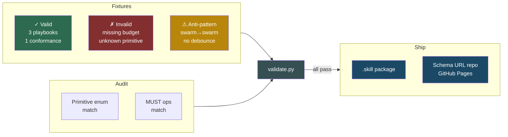

# Coordination Model Validation & Distribution — Fixtures, Audit & Packaging

## Overview

Validates the schemas from spec 020 with deterministic test fixtures, audits cross-schema consistency, and packages the skill for distribution. This is the "prove it works and ship it" layer.

## Design

### Test Fixtures

Valid playbook fixtures for all 3 reference compositions:
- `explore-harden-maintain.yaml` — speculative-swarm → generative-adversarial → stigmergic
- `mesh-fractal-swarm.yaml` — context-mesh → fractal-decomposition → speculative-swarm
- `swarm-mesh-stigmergy.yaml` — speculative-swarm → context-mesh → stigmergic

Valid conformance fixture:
- `clawden-conformance.json` — all MUST = true

Invalid fixtures (must fail validation):
- `invalid-missing-budget.yaml` — stage omits `budget` block
- `invalid-unknown-primitive.yaml` — `primitive: "custom-thing"`

Anti-pattern fixtures (valid schema, warns on composition):
- `antipattern-swarm-swarm.yaml` — swarm nested in swarm
- `antipattern-no-debounce.yaml` — stigmergic without `reaction_debounce`

### Schema Cross-Consistency Audit

Programmatic checks:
- Primitive enum in `playbook.schema.json` = primitive enum in `primitives.schema.json`
- MUST operations in `conformance.schema.json` = operation names in `operations.schema.json`
- Every primitive's `operations_used` from SKILL.md maps to valid `operations.schema.json` entries
- Every config field in `primitives.schema.json` matches SKILL.md config surface description

### Distribution

- Package skill as `.skill` file for agentskills.io
- Create `codervisor/coordination-model-schema` repo with schema files + GitHub Pages
- Verify `$id` URLs resolve to served schema files

## Plan

- [ ] Create valid playbook fixtures for all 3 reference compositions
- [ ] Create valid conformance fixture for ClawDen
- [ ] Create invalid fixtures that must fail validation
- [ ] Run `validate.py` against all fixtures — valid pass, invalid fail
- [ ] Audit primitive enum consistency across schemas
- [ ] Audit MUST operations consistency across schemas
- [ ] Package skill as `.skill` file
- [ ] Create schema URL repository with GitHub Pages

## Test

### Fixture validation (deterministic)

| Fixture                          | Expected        | Assertion                         |
| -------------------------------- | --------------- | --------------------------------- |
| `explore-harden-maintain.yaml`   | OK, no warnings | exit 0, no WARNING in stderr      |
| `mesh-fractal-swarm.yaml`        | OK              | exit 0                            |
| `clawden-conformance.json`       | OK, CONFORMANT  | exit 0, stdout has "CONFORMANT"   |
| `invalid-missing-budget.yaml`    | FAIL            | exit 1, stderr has "budget"       |
| `invalid-unknown-primitive.yaml` | FAIL            | exit 1                            |
| `antipattern-swarm-swarm.yaml`   | OK + WARNING    | exit 0, stderr has "Anti-pattern" |
| `antipattern-no-debounce.yaml`   | FAIL            | exit 1                            |

### Cross-consistency

- [ ] Playbook primitive enum = Primitives primitive enum (exact set match)
- [ ] Conformance MUST operations = Operations operation names (exact set match)