# Coordination Primitives Visual Reference

## Overview

Visual reference for all 11 coordination primitives — 5 AI-native (Category B) and 6 organizational (Category A). Each primitive shows the agent flow, operations used, and key structural insight.

This spec is a reference companion to spec 019 (theory). No implementation, no schemas — just diagrams.

## Design

### Category B: AI-Native Primitives

#### Speculative Swarm

Fork N divergent strategies from a single agent, cross-pollinate insights, measure convergence, prune losers, fuse the best fragments.

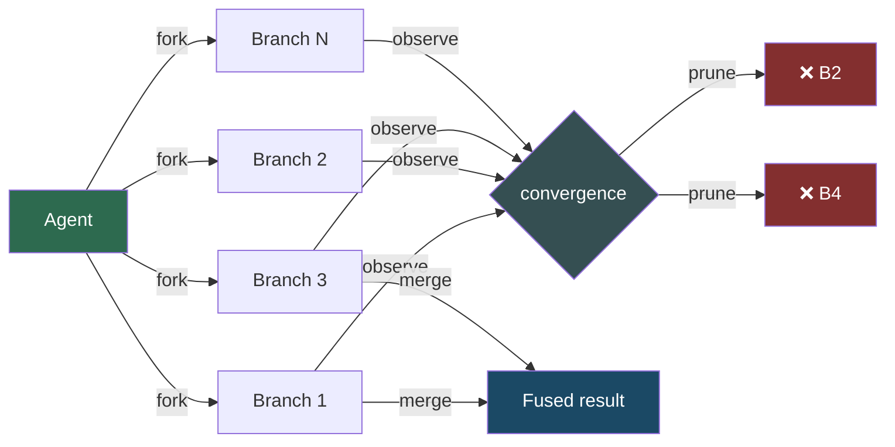

**Key insight**: The result contains fragments from multiple branches — not "best branch wins" but "best pieces from each branch fused together."

#### Context Mesh

Shared knowledge DAG where any agent's discovery is instantly available to all others. Knowledge gaps trigger reactive spawning.

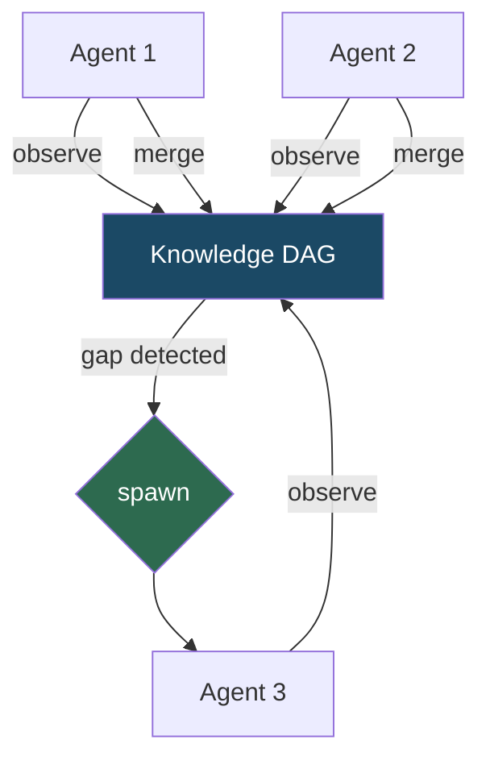

**Key insight**: Coordination is implicit — agents read/write a shared DAG. No point-to-point messages. Gap detection drives agent creation.

#### Fractal Decomposition

An agent splits itself into scoped sub-agents recursively. Each child inherits full context and specializes on a subset.

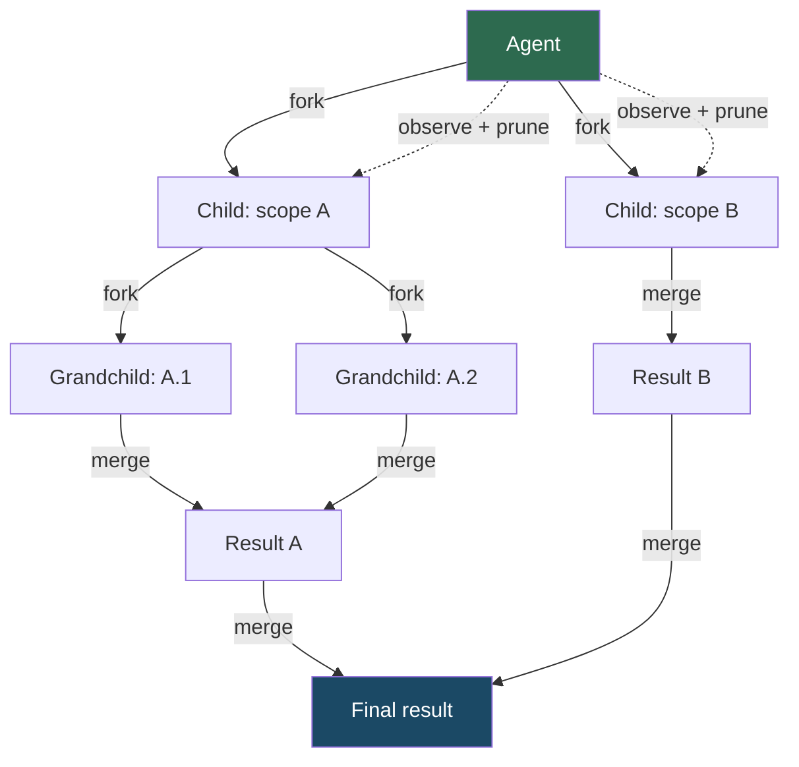

**Key insight**: Recursion depth is dynamic — each child decides whether to split further based on scope complexity. Prune collapses branches that converge early.

#### Generative-Adversarial

Generator and critic agents escalate quality in a tight loop. Critic difficulty increases each round until quality threshold is met.

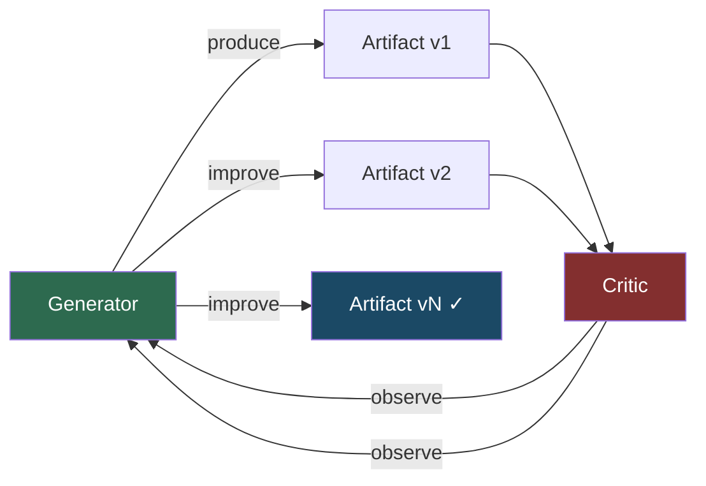

**Key insight**: Only two agents, but round count is unbounded. Termination is quality-driven (consecutive clean rounds), not time-driven.

#### Stigmergic

Agents coordinate purely through shared artifact changes — like ants leaving pheromone trails. No direct messaging.

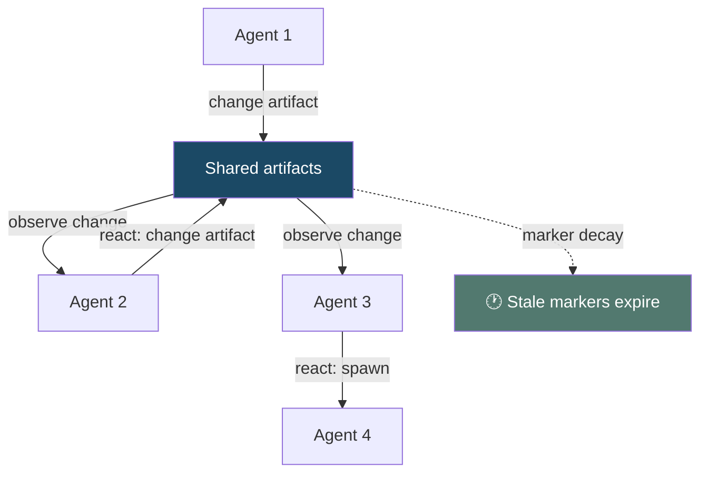

**Key insight**: Coordination cost is O(artifacts), not O(agents²). Debounce is structurally required to prevent reaction storms.

### Category A: Organizational Primitives

#### Hierarchical

Manager delegates to workers, observes results, aggregates.

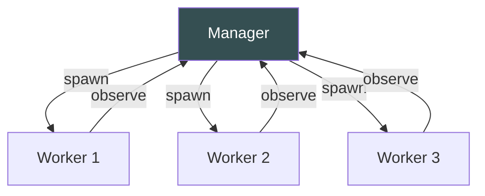

#### Pipeline

Sequential stages — output of one becomes input of the next.

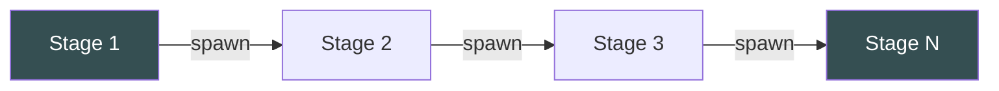

#### Committee

Peers deliberate independently, then vote on the outcome.

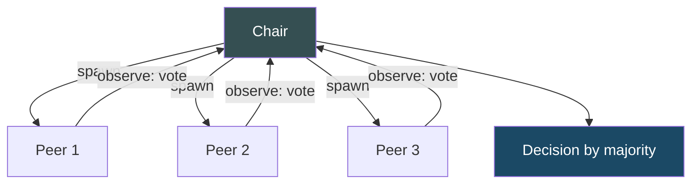

#### Departmental

Functional groups work in parallel, with cross-group sync points.

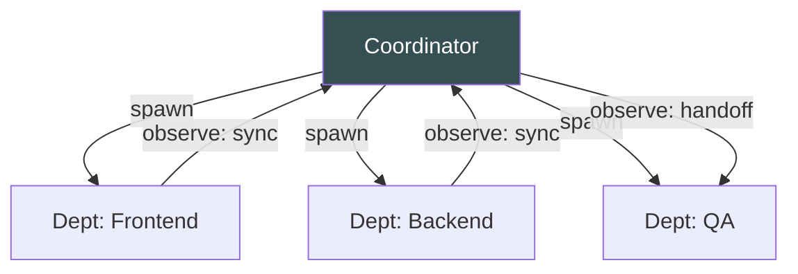

#### Marketplace

Tasks posted to a shared queue. Agents bid or claim based on capability.

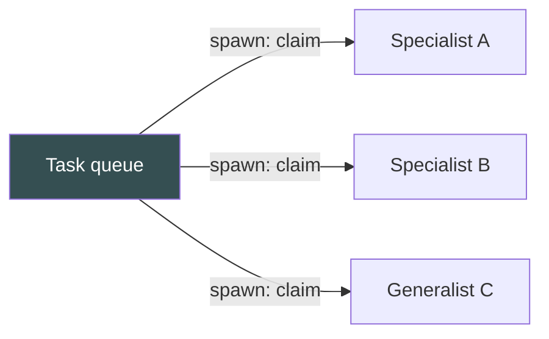

#### Matrix

Dual reporting — agents serve both a functional specialty and a project goal.

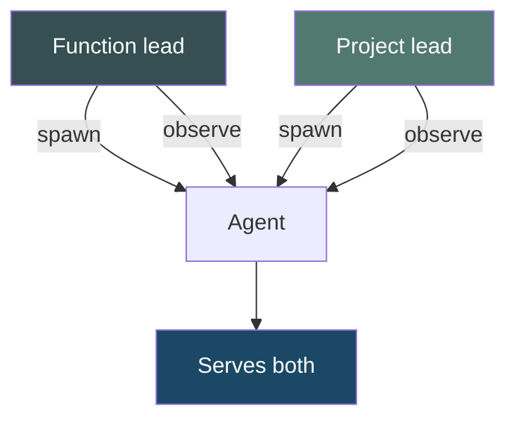

## Plan

- [x] Diagram all 5 AI-native primitives with flow + key insight
- [x] Diagram all 6 organizational primitives

## Test

- [ ] Every diagram renders correctly in Mermaid
- [ ] Every primitive from spec 019 is represented