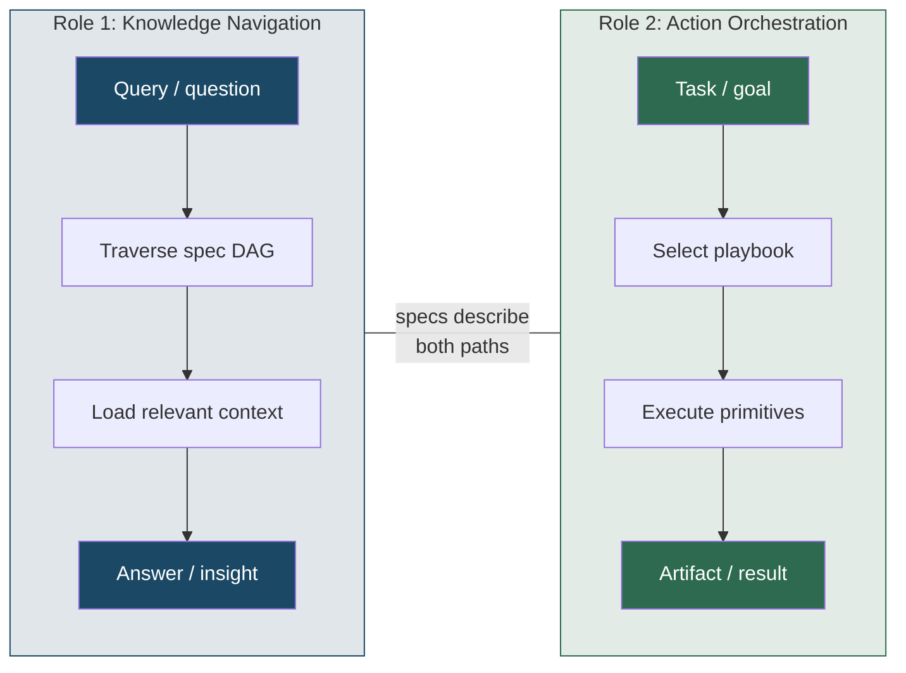
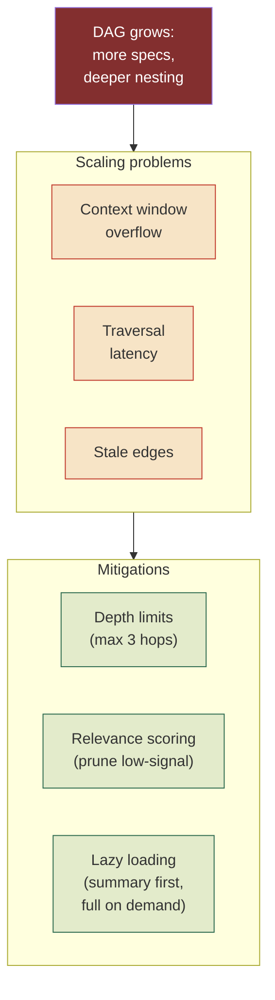

# Coordination Model — Roles, Boundaries & Scaling Limits

## Overview

Defines what the coordination model **can do**, what it **cannot do**, and where it breaks under scale. Separates the two distinct roles the model serves — knowledge navigation and action orchestration — so implementers know which role applies to a given problem and where the boundaries are.

This spec exists because roles and limitations are architectural constraints that precede design (020) and validation (021). Getting them wrong means building schemas for use cases the model doesn't actually support.

## Design

### Two roles of the coordination model

The model serves two purposes that look similar but have different failure modes:

**Role 1 — Knowledge navigation.** Specs form a directed acyclic graph (the "knowledge DAG"). An agent traversing this graph can discover what primitives exist, how they compose, what anti-patterns to avoid, and which playbooks apply to a given problem class. This role is **read-only** — it changes no state and produces no artifacts beyond the agent's updated context.

- Input: a question or problem description
- Process: walk parent → child → dependency edges, load relevant spec content
- Output: context sufficient to make a decision or answer a question
- Failure mode: loading too much irrelevant context (noise), or missing a dependency edge (blind spot)

**Role 2 — Action orchestration.** The same specs also define executable patterns: playbooks composed of primitives, with entry conditions, exit criteria, and cost tiers. An agent using the model in this role **changes state** — it spawns agents, forks strategies, merges results, writes artifacts.

- Input: a task with acceptance criteria
- Process: select playbook → instantiate primitives → execute operations → validate output
- Output: artifacts (code, docs, decisions) that didn't exist before
- Failure mode: wrong playbook selection (mismatch), primitive misuse (e.g., swarm without convergence threshold), unbounded cost

### What the model does NOT cover

| Out of scope | Why |
| --- | --- |
| Agent implementation | The model defines coordination patterns, not how individual agents reason, plan, or generate output |
| LLM selection / routing | Which model powers an agent is a runtime concern; the model only specifies cost tiers (frontier / mid / student) |
| Persistence / storage | How state is stored (SQLite, S3, memory) is an implementation detail below the abstraction layer |
| Network transport | Wire format, serialization, retry logic — all below the coordination layer |
| Authentication / authorization | Who is *allowed* to spawn/prune/observe is a policy layer above the coordination model |
| Human-in-the-loop approval | The model assumes agents act autonomously; approval gates are an orchestration-layer extension |

### Scaling limits and growth management

The knowledge DAG and primitive execution both face growth pressure. These are the known limits and mitigations:

| Limit | Threshold | Mitigation |
| --- | --- | --- |
| **DAG depth** | >4 levels of parent → child nesting | Depth-limited traversal: default 3 hops, extend only on explicit request |
| **DAG breadth** | >20 specs at same level | Relevance scoring: rank by tag overlap and recency, load top-N |
| **Context window** | Loaded specs exceed model context | Lazy loading: load summaries (Overview section only) first, expand on demand |
| **Stale edges** | Dependency points to archived/superseded spec | Staleness audit: `validate` flags edges to non-active specs |
| **Primitive fan-out** | Swarm/fractal spawns >16 agents | Hard cap per primitive instance; configurable per cost tier |
| **Composition depth** | >3 nesting levels of primitives | Structural limit: compositions deeper than 3 are anti-patterns (see 019) |
| **Cost runaway** | Total fleet cost exceeds budget | Circuit breaker: halt spawning when cumulative cost hits threshold |

### Role selection heuristic

When an agent encounters the coordination model, it should determine which role applies:

| Signal | Role 1 (navigate) | Role 2 (orchestrate) |
| --- | --- | --- |
| Task has acceptance criteria | — | ✓ |
| Question starts with "what/why/how does" | ✓ | — |
| Output is an artifact (code, config, doc) | — | ✓ |
| Output is a decision or recommendation | ✓ | — |
| Multiple agents needed | — | ✓ |
| Single agent sufficient | ✓ | — |

## Plan

- [ ] Define role 1 (knowledge navigation) contract
- [ ] Define role 2 (action orchestration) contract
- [ ] Document out-of-scope boundaries
- [ ] Document scaling limits with thresholds and mitigations
- [ ] Add role selection heuristic

## Test

- [ ] Every scaling limit has a numeric threshold and a named mitigation
- [ ] Out-of-scope table covers all layers adjacent to the coordination model
- [ ] Role selection heuristic produces unambiguous assignment for 10 sample scenarios

## Notes

This spec intentionally avoids prescribing *how* mitigations are implemented — depth limiting could be a graph traversal parameter, a CLI flag, or a schema constraint. That decision belongs in 020 (design) and the implementing runtime.