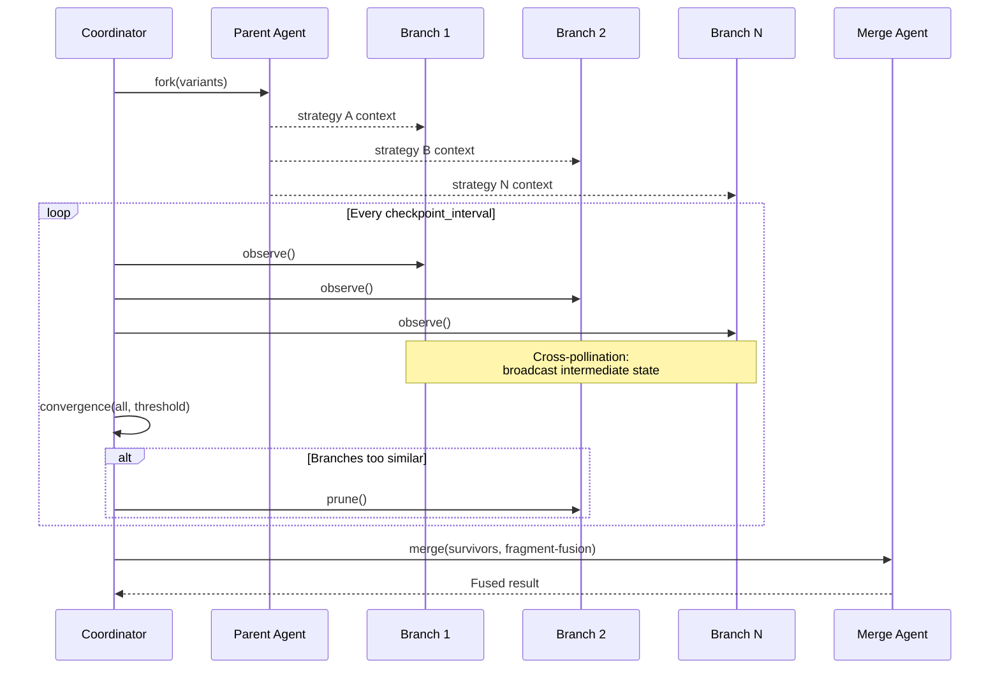

# Speculative Swarm — Primitive Deep Dive

## Overview

Deep-dive reference for the **speculative swarm** primitive — one of the five AI-native coordination patterns defined in spec 019. This spec provides the complete operation lifecycle, configuration surface, composability guidance, failure modes, and worked examples for implementers and agents selecting coordination strategies.

**Agent property exploited:** Zero fork cost + speculative parallelism — agents can execute N mutually exclusive strategies simultaneously, which humans cannot.

**Operations used:** fork, observe, convergence, prune, merge

## Design

### What speculative swarm does

Forks N agents from a single parent to explore divergent strategies for the same task simultaneously. At configurable checkpoints, branches cross-pollinate insights. Convergence detection prunes redundant branches. Fragment fusion merges the best pieces from surviving branches into a result no single branch could produce.

**This is not a committee or ensemble.** Committees discuss and vote on one solution. Ensembles average independent predictions. Speculative swarm *executes divergently and fuses selectively*.

### Operation lifecycle



**Phase 1 — Seed:** The coordinator forks the parent agent N times. Each fork receives the parent's full accumulated context plus a unique strategy prompt (e.g., "solve via recursion," "solve via reduction").

**Phase 2 — Exploration:** All forks execute independently. At configurable checkpoints, each fork's intermediate state is broadcast to all others. Forks may incorporate useful fragments from siblings — this is cross-pollination, not consensus.

**Phase 3 — Convergence detection:** The coordinator continuously measures output similarity across branches. When two branches produce output exceeding the convergence threshold, the lower-quality branch is pruned to reclaim resources.

**Phase 4 — Fragment fusion:** Surviving branches' outputs are decomposed into scored fragments. A merge agent assembles the final output by selecting the highest-scoring fragment for each sub-problem.

### Configuration surface

```yaml
fleet:
  swarms:
    <swarm-name>:
      base_agent: <agent-id>            # Parent agent to fork from
      strategies:                        # Divergent strategy prompts
        - prompt_suffix: "approach via divide-and-conquer"
        - prompt_suffix: "approach via constraint propagation"
        - prompt_suffix: "approach via analogy from similar domains"
      checkpoint_interval: 30s           # Cross-pollination frequency
      convergence_threshold: 0.85        # 0.0–1.0 similarity for pruning
      merge: fragment-fusion             # fragment-fusion | winner-take-all | weighted-blend
      max_forks: 8                       # Hard cap on branch count
      budget:
        max_tokens: 500000
        max_cost_usd: 2.00
```

### Merge strategies

| Strategy | Behavior | When to use |
| --- | --- | --- |
| `fragment-fusion` | Decompose outputs into scored fragments, select best per sub-problem | Default — produces novel composite outputs |
| `winner-take-all` | Select the single highest-quality branch output | When outputs are atomic (can't be decomposed) |
| `weighted-blend` | Weighted combination of all surviving branches | When outputs are numeric or probabilistic |

### Composability

| Composition | Valid | Rationale |
| --- | --- | --- |
| Pipeline → Swarm | ✓ | Each pipeline stage is independent; swarming within a stage doesn't affect others |
| Swarm → Adversarial | ✓ | Each branch gets adversarial hardening before the merge selects among them |
| Mesh → Swarm | ✓ | A knowledge gap triggers a swarm to explore multiple resolution strategies |
| **Swarm → Swarm** | ✗ | N outer × M inner = N·M agents. Multiplicative cost with no convergence guarantee |

### Failure modes

| Failure | Symptom | Mitigation |
| --- | --- | --- |
| Premature convergence | All branches collapse to same strategy early | Lower convergence threshold; increase strategy diversity |
| No convergence | Branches never align; budget exhausted | Set max_time or max_cost budget as hard stop |
| Fragment incompatibility | Fused fragments conflict semantically | Use winner-take-all fallback when fragment scoring is unreliable |
| Cross-pollination bias | All branches copy the strongest branch's approach | Limit cross-pollination to metadata, not full output |

### Worked example: multi-strategy code solver

A coding agent faces a complex algorithmic problem. The swarm forks 4 branches:
1. Divide-and-conquer approach
2. Dynamic programming approach
3. Greedy heuristic approach
4. Reduction to known problem

At checkpoint 1, branch 3 (greedy) discovers an edge case. This insight is cross-pollinated to all branches. Branch 4 (reduction) incorporates it. At checkpoint 2, branches 1 and 2 converge (both found the same substructure) — branch 2 is pruned. Final merge takes the core algorithm from branch 1, the edge-case handling from branch 3, and the proof structure from branch 4.

## Plan

- [x] Document operation lifecycle with sequence diagram
- [x] Define configuration surface with YAML schema
- [x] Document merge strategies and selection criteria
- [x] Document composability rules
- [x] Document failure modes and mitigations
- [x] Provide worked example

## Test

- [ ] Operation lifecycle uses only {fork, observe, convergence, prune, merge} — matching spec 019
- [ ] Config surface fields align with primitives.schema.json (spec 020)
- [ ] Anti-pattern (swarm → swarm) is documented
- [ ] Every merge strategy has a "when to use" rationale