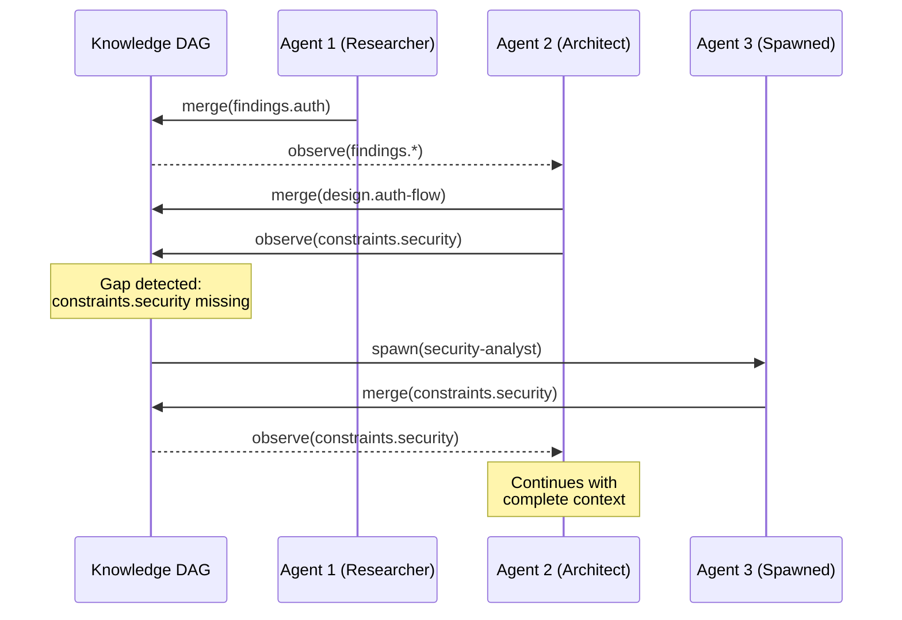

# Context Mesh — Primitive Deep Dive

## Overview

Deep-dive reference for the **context mesh** primitive — one of the five AI-native coordination patterns defined in spec 019. This spec provides the complete operation lifecycle, configuration surface, composability guidance, failure modes, and worked examples for implementers and agents selecting coordination strategies.

**Agent property exploited:** Lossless context transfer — agents can share full internal state without information loss. Humans lose information at every handoff.

**Operations used:** spawn, observe, merge

### What context mesh does

Builds a shared, reactive knowledge graph (DAG) where agents observe knowledge gaps and fill them autonomously. No routing, no handoffs, no manager deciding who knows what. Coordination emerges from information availability, not organizational structure.

**This is not departmental routing.** Departments gate knowledge through managers and gateway agents. Context mesh makes *all knowledge visible to all agents simultaneously*.

## Design

### Operation lifecycle



**Phase 1 — Graph seeding:** Initial agents spawn with domain-scoped watch and publish patterns. Each agent begins producing knowledge claims (nodes) and reading claims from others.

**Phase 2 — Reactive propagation:** When a node is created or updated, all agents watching matching patterns are notified with the delta. No polling, no status meetings — changes push to subscribers.

**Phase 3 — Gap detection:** Agents continuously scan for missing dependencies: "Node X depends on Y, but Y doesn't exist." Any agent with relevant capability can claim the gap. If no existing agent can fill it, a new agent is spawned.

**Phase 4 — Conflict resolution:** If two agents fill the same gap, a compete-and-compare evaluates both versions. The higher-confidence version wins. Unlike human turf wars, this takes milliseconds.

### Knowledge DAG structure

```
Node {
    key: string           # Hierarchical key (e.g., "findings.auth.tokens")
    value: any            # The knowledge claim
    confidence: f64       # 0.0–1.0 authoritativeness
    dependencies: [key]   # What this node needs to be valid  
    author: agent_id      # Which agent produced this
    version: u64          # Monotonically increasing
}
```

Edges are dependency relationships: if node A lists node B in its dependencies, B must exist and be filled before A is considered complete.

### Configuration surface

```yaml
fleet:
  mesh:
    context_graph:
      storage: shared-kv                # Backend for the DAG
      propagation: reactive             # reactive | polling
      conflict: compete-and-compare     # compete-and-compare | last-write-wins | manual
      gap_spawn: true                   # Auto-spawn agents for unfilled gaps
    agents:
      - id: researcher
        watches: ["requirements.*", "constraints.*"]
        publishes: ["findings.*", "evidence.*"]
      - id: architect
        watches: ["findings.*", "constraints.*"]
        publishes: ["design.*", "interfaces.*"]
      - id: implementer
        watches: ["design.*", "interfaces.*"]
        publishes: ["code.*", "tests.*"]
```

### Conflict resolution strategies

| Strategy | Behavior | When to use |
| --- | --- | --- |
| `compete-and-compare` | Both versions evaluated by confidence score, higher wins | Default — works when confidence scoring is reliable |
| `last-write-wins` | Most recent write takes precedence | Fast-moving domains where recency ≈ correctness |
| `manual` | Conflict flagged for coordinator or human review | High-stakes knowledge where automated resolution is risky |

### Composability

| Composition | Valid | Rationale |
| --- | --- | --- |
| Mesh → Swarm | ✓ | A knowledge gap triggers a swarm to explore multiple resolution strategies |
| Pipeline → Mesh | ✓ | Each pipeline stage enriches the shared DAG for downstream stages |
| Mesh → Fractal | ✓ | A complex gap discovered in the mesh gets fractal decomposition |
| **Mesh → Mesh** | Caution | Nested meshes risk duplicate knowledge claims; prefer a single graph |

### Failure modes

| Failure | Symptom | Mitigation |
| --- | --- | --- |
| Context overload | Agents receive too many notifications, degrade quality | Narrow watch patterns; introduce relevance scoring |
| Circular dependencies | Node A depends on B, B depends on A — gap never fills | Cycle detection in DAG validation; reject circular dependency edges |
| Stale nodes | Knowledge becomes outdated but isn't refreshed | TTL on nodes; confidence decay over time |
| Gap spawn storm | Many gaps detected simultaneously → too many agents spawned | Rate limiting on gap-triggered spawns; budget cap |

### Worked example: cross-domain research synthesis

Three agents work on a system design. The researcher publishes `findings.auth.oauth-flows` and `findings.auth.token-formats`. The architect, watching `findings.*`, observes these and produces `design.auth-service`. The architect also reads `constraints.security.encryption` — but that node doesn't exist. Gap detection spawns a security-analyst agent, which fills `constraints.security.encryption`. The update propagates reactively to the architect, who revises `design.auth-service` to incorporate the encryption constraint. The implementer, watching `design.*`, picks up the revised design and produces `code.auth-service`. No coordinator directed any of this — workflow emerged from the knowledge graph structure.

## Plan

- [x] Document operation lifecycle with sequence diagram
- [x] Define knowledge DAG node structure
- [x] Define configuration surface with YAML schema
- [x] Document conflict resolution strategies
- [x] Document composability rules
- [x] Document failure modes and mitigations
- [x] Provide worked example

## Test

- [ ] Operation lifecycle uses only {spawn, observe, merge} — matching spec 019
- [ ] Config surface fields align with primitives.schema.json (spec 020)
- [ ] Conflict resolution strategies are exhaustive
- [ ] Gap detection and spawn behavior is clearly specified