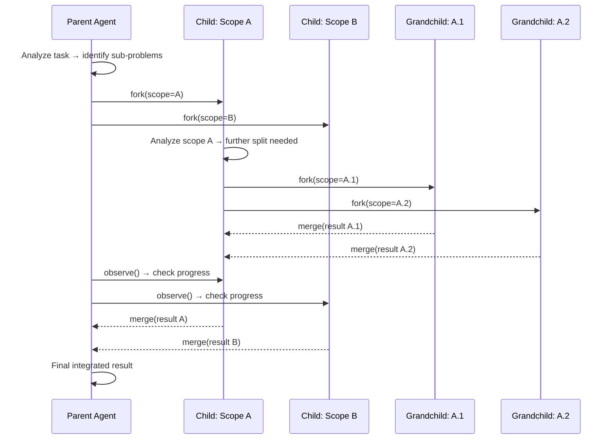

# Fractal Decomposition — Primitive Deep Dive

## Overview

Deep-dive reference for the **fractal decomposition** primitive — one of the five AI-native coordination patterns defined in spec 019. This spec provides the complete operation lifecycle, configuration surface, composability guidance, failure modes, and worked examples for implementers and agents selecting coordination strategies.

**Agent property exploited:** Zero fork cost + self-similarity — an agent splits itself into scoped sub-agents recursively, like cell division. Sub-agents inherit full context and specialize. Humans can't clone themselves mid-task with full memory.

**Operations used:** fork, observe, merge, prune

### What fractal decomposition does

An agent facing a complex task splits itself into scoped sub-agents, each inheriting the parent's full context but narrowing to a specific sub-problem. Sub-agents may recursively split further. On completion, they reunify losslessly into the original.

**This is not hierarchical delegation.** Hierarchy has information loss at every level (manager briefs worker, worker briefs sub-worker). Fractal decomposition has *zero information loss* because the children ARE the parent.

## Design

### Operation lifecycle



**Phase 1 — Analysis:** The parent agent analyzes its task and identifies N orthogonal sub-problems. Orthogonality is key — sub-problems must be independently solvable to avoid conflicting writes.

**Phase 2 — Split:** The parent forks itself N times. Each child receives the parent's full context plus a scoping constraint ("you are responsible only for sub-problem K"). Children can only modify artifacts within their scoped sub-problem — scope isolation prevents conflicts without locks.

**Phase 3 — Recursive descent:** Each child evaluates whether its sub-problem is still complex enough to warrant further splitting. If so, it forks again. Depth is bounded by configuration.

**Phase 4 — Reunification:** When all children complete, their outputs merge back into the parent agent. Because children were forks of the parent (not strangers), reunification is lossless — the parent integrates sub-results with full understanding of *why* each child made its choices.

**Phase 5 — Pruning:** During execution, the parent observes children. If a child's scope converges early (trivial sub-problem) or becomes irrelevant, it can be pruned to reclaim resources.

### Scope isolation model

```
Parent scope: "design a web application"
├── Child 1 scope: "design the authentication system"
│   ├── Grandchild 1.1: "design OAuth flow"
│   └── Grandchild 1.2: "design session management"
├── Child 2 scope: "design the data layer"
│   ├── Grandchild 2.1: "design schema"
│   └── Grandchild 2.2: "design query patterns"
└── Child 3 scope: "design the API surface"
```

Each node can only write to artifacts within its declared scope. Cross-scope reads are permitted (via observe), but cross-scope writes are rejected.

### Configuration surface

```yaml
fleet:
  fractal:
    <solver-name>:
      base_agent: <agent-id>              # Root agent to begin splitting
      split_strategy: orthogonal-subproblems  # How to identify sub-problems
      max_depth: 4                          # Maximum recursion depth
      max_children_per_level: 5             # Max forks at any single level
      reunification: lossless-merge         # lossless-merge | best-child | summary-merge
      scope_isolation: true                 # Enforce write isolation per scope
      budget:
        max_total_agents: 20                # Hard cap on total agents across all levels
```

### Reunification strategies

| Strategy | Behavior | When to use |
| --- | --- | --- |
| `lossless-merge` | All child outputs integrated into parent with full context | Default — preserves maximum information |
| `best-child` | Select the single child output that best addresses the parent's goal | When sub-problems overlap more than expected |
| `summary-merge` | Each child produces a summary; parent synthesizes from summaries | When full merge would exceed context limits |

### Split strategy

The `split_strategy` determines how the agent identifies sub-problems:

| Strategy | Behavior | When to use |
| --- | --- | --- |
| `orthogonal-subproblems` | Agent identifies non-overlapping sub-problems | Default — clean decomposition |
| `aspect-based` | Split by cross-cutting concerns (security, performance, correctness) | When the problem has multiple evaluation axes |
| `temporal` | Split by phases (plan → implement → validate) | When the problem has natural sequential stages |

### Composability

| Composition | Valid | Rationale |
| --- | --- | --- |
| Fractal → Committee | ✓ | Each fractal child deliberates via committee for its scoped piece |
| Stigmergic → Fractal | ✓ | An artifact change creates a sub-problem; fractal decomposes it |
| Pipeline → Fractal | ✓ | Each pipeline stage is fractal-decomposed independently |
| **Fractal → Fractal** | Caution | Depth compounds — ensure total depth stays within max_depth budget |

### Failure modes

| Failure | Symptom | Mitigation |
| --- | --- | --- |
| Non-orthogonal split | Children produce conflicting writes to same artifact | Improve split analysis; enable scope isolation enforcement |
| Depth explosion | Recursive splitting exceeds resource budget | Hard max_depth and max_total_agents caps |
| Reunification overload | Merging many deep children exceeds context window | Use summary-merge strategy; limit max_children_per_level |
| Trivial splits | Agent splits into sub-problems too small to benefit from isolation | Minimum complexity threshold before forking is permitted |

### Worked example: system design decomposition

An architect agent is tasked with designing a microservices platform. It identifies 3 orthogonal sub-problems: (1) service mesh and networking, (2) data persistence and state management, (3) API gateway and auth. It forks into 3 children.

Child 1 (networking) further splits into "service discovery" and "traffic management." Child 2 (data) splits into "schema design" and "caching strategy." Child 3 (API) doesn't split — it's simple enough to handle directly.

The grandchildren complete first and merge back into their parents. Then the 3 children merge back into the root architect, which now has a coherent platform design that integrates networking, data, and API concerns — with full understanding of how each decision was made.

## Plan

- [x] Document operation lifecycle with sequence diagram
- [x] Define scope isolation model
- [x] Define configuration surface with YAML schema
- [x] Document reunification and split strategies
- [x] Document composability rules
- [x] Document failure modes and mitigations
- [x] Provide worked example

## Test

- [ ] Operation lifecycle uses only {fork, observe, merge, prune} — matching spec 019
- [ ] Config surface fields align with primitives.schema.json (spec 020)
- [ ] Scope isolation mechanism is clearly defined
- [ ] Recursive depth management has hard limits