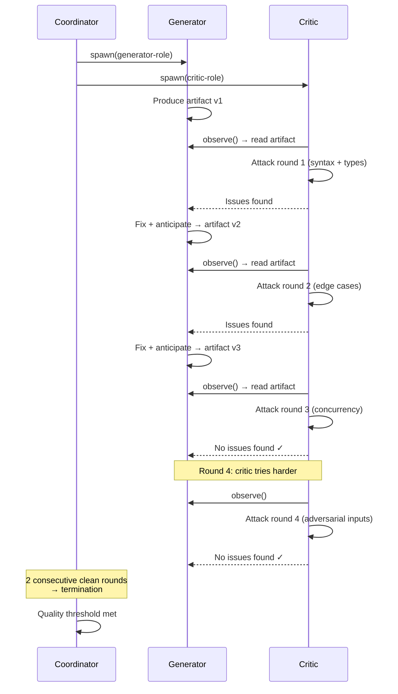

# Generative-Adversarial Coordination — Primitive Deep Dive

## Overview

Deep-dive reference for the **generative-adversarial coordination** primitive — one of the five AI-native coordination patterns defined in spec 019. This spec provides the complete operation lifecycle, configuration surface, composability guidance, failure modes, and worked examples for implementers and agents selecting coordination strategies.

**Agent property exploited:** No fatigue + lossless critique — agents maintain consistent quality across arbitrarily many review rounds without ego, defensiveness, or cognitive degradation. Human review depth is limited by time and social dynamics.

**Operations used:** spawn, observe

### What generative-adversarial coordination does

Two agent roles — generator and critic — locked in an escalating quality loop. The critic doesn't just review; it *actively tries to break* the generator's output. The generator doesn't just fix; it *anticipates and preempts* the critic's attack patterns. Quality emerges from adversarial pressure, not checklist compliance.

**This is not code review.** Human review has social dynamics — reviewers don't want to seem hostile, authors get defensive. Agents have no ego. The adversarial pressure can be maximally intense without social cost.

## Design

### Operation lifecycle



**Phase 1 — Generation:** The generator agent produces an initial artifact (code, plan, design document, configuration).

**Phase 2 — Attack:** The critic agent actively attempts to break the artifact: generate adversarial inputs, find logical flaws, construct edge cases, attempt to violate stated invariants. The critic can *execute* the generator's code and construct test cases automatically.

**Phase 3 — Escalation:** Each round, the critic's attack sophistication increases. The escalation ladder is configurable:

| Round | Critic mode | Description |
| --- | --- | --- |
| 1 | `syntax-and-types` | Surface-level correctness |
| 2 | `edge-cases` | Boundary conditions, empty inputs, overflow |
| 3 | `concurrency-safety` | Race conditions, deadlocks, resource contention |
| 4 | `adversarial-inputs` | Malformed data, injection attempts, resource exhaustion |
| 5+ | `semantic-analysis` | Logic errors, invariant violations, specification gaps |

**Phase 4 — Termination:** The loop ends when any termination condition is met:
- K consecutive rounds where the critic finds no new issues
- A quality score exceeds the configured threshold
- Maximum round count reached (safety cap)

### Configuration surface

```yaml
fleet:
  adversarial:
    <session-name>:
      generator: <agent-id>              # The producing agent
      critic: <agent-id>                  # The attacking agent
      max_rounds: 10                      # Hard cap on iteration count
      escalation: progressive             # progressive | fixed | random
      termination:
        consecutive_clean_rounds: 2       # Rounds with no new issues to stop
        quality_threshold: 0.95           # 0.0–1.0 quality score target
      critic_modes:                       # Escalation ladder (order matters)
        - syntax-and-types
        - edge-cases
        - concurrency-safety
        - adversarial-inputs
      budget:
        max_tokens: 200000
        max_cost_usd: 1.00
```

### Escalation modes

| Mode | Behavior | When to use |
| --- | --- | --- |
| `progressive` | Critic difficulty increases each round following the critic_modes ladder | Default — most efficient for iterative hardening |
| `fixed` | Critic uses the same attack level every round | When targeting a specific quality dimension |
| `random` | Critic randomly selects attack level each round | When testing robustness against unpredictable challenge |

### Composability

| Composition | Valid | Rationale |
| --- | --- | --- |
| Swarm → Adversarial | ✓ | Each swarm branch gets adversarial hardening before the merge selects among them |
| Pipeline → Adversarial | ✓ | Each pipeline stage output is adversarially hardened before passing downstream |
| Fractal → Adversarial | ✓ | Each fractal child's output is quality-checked before reunification |
| **Adversarial → Adversarial** | ✗ | Inner critic criticizes outer critic — meta-critique without grounded production |

### Failure modes

| Failure | Symptom | Mitigation |
| --- | --- | --- |
| Infinite loop | Generator and critic cycle without quality improvement | Max rounds cap; quality plateau detection (no improvement for N rounds) |
| Overcorrection | Generator fixes one issue but introduces another | Track regression: critic re-checks all previous issues each round |
| Weak critic | Critic fails to find real issues → false sense of quality | Use multiple critic modes; periodically inject known-flawed artifacts as calibration |
| Destructive criticism | Critic demands contradictory changes | Critic must provide concrete failing test cases, not abstract objections |

### Generator-critic contract

The adversarial loop works because both roles follow a contract:

**Generator MUST:**
- Produce a complete, testable artifact each round
- Address all issues from the previous round
- Not suppress or ignore critic feedback

**Critic MUST:**
- Provide specific, reproducible issues (not vague complaints)
- Escalate difficulty as configured
- Report "clean" honestly when no issues are found

### Worked example: API endpoint hardening

A generator agent produces a REST API endpoint handler. Round 1 (syntax): critic checks types, finds a missing null check — generator fixes. Round 2 (edge cases): critic sends empty body, oversized payload, unicode in path params — finds the oversized payload crashes the handler — generator adds size validation. Round 3 (concurrency): critic simulates concurrent requests — finds a race condition in the rate limiter — generator switches to atomic operations. Round 4 (adversarial): critic sends SQL injection payloads, XSS vectors, path traversal — all blocked. Round 5 (adversarial, harder): critic constructs a time-of-check-time-of-use payload — blocked. Two consecutive clean rounds → loop terminates. The endpoint is now hardened against 5 levels of attack sophistication.

## Plan

- [x] Document operation lifecycle with sequence diagram
- [x] Define escalation ladder and modes
- [x] Define configuration surface with YAML schema
- [x] Document composability rules
- [x] Define generator-critic contract
- [x] Document failure modes and mitigations
- [x] Provide worked example

## Test

- [ ] Operation lifecycle uses only {spawn, observe} — matching spec 019
- [ ] Config surface fields align with primitives.schema.json (spec 020)
- [ ] Anti-pattern (adversarial → adversarial) is documented
- [ ] Escalation ladder has ≥4 distinct critic modes
- [ ] Termination conditions are complete (time, quality, round count)