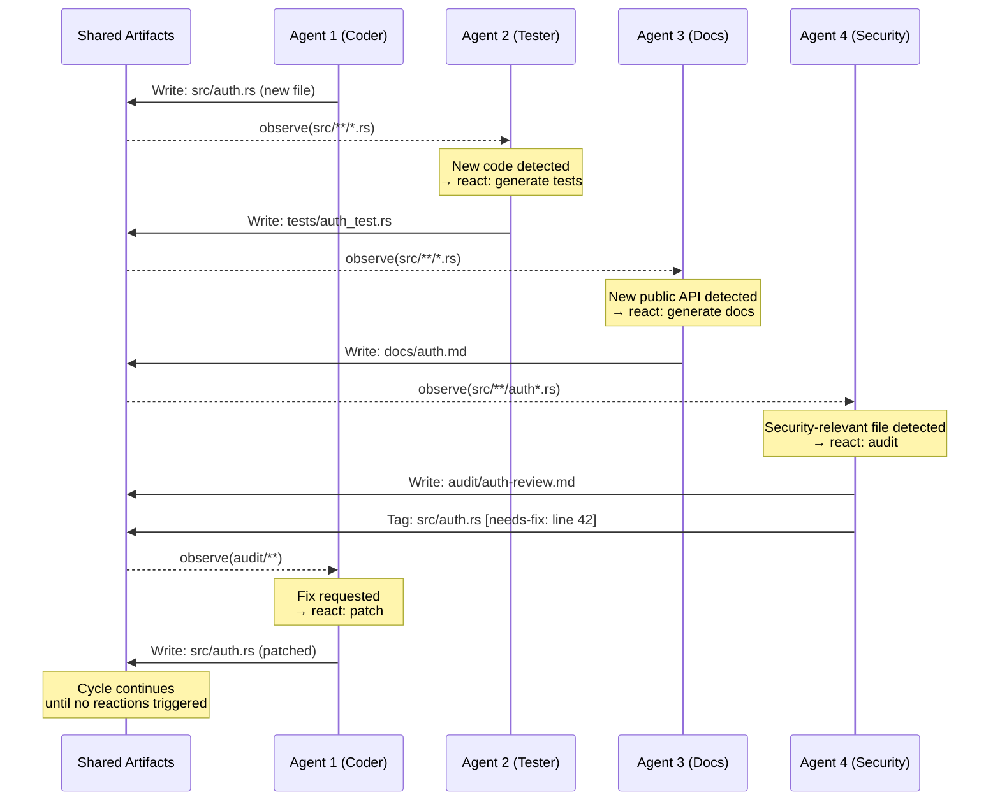

# Stigmergic Coordination — Primitive Deep Dive

## Overview

Deep-dive reference for the **stigmergic coordination** primitive — one of the five AI-native coordination patterns defined in spec 019. This spec provides the complete operation lifecycle, configuration surface, composability guidance, failure modes, and worked examples for implementers and agents selecting coordination strategies.

**Agent property exploited:** Environment as communication — agents can continuously monitor a shared artifact space and react in real-time to every change. Human stigmergy (leaving notes on a whiteboard) is lossy and slow; agent stigmergy is precise and instant.

**Operations used:** observe, spawn

### What stigmergic coordination does

Agents coordinate through the shared artifact space rather than through messages. Like ants depositing pheromones: agents observe changes to shared artifacts and react to them. No central coordinator, no task queue, no explicit routing. Workflow *emerges* from agent reaction patterns.

**This is not event-driven architecture.** Event-driven systems have predefined event types and handlers. Stigmergic coordination has agents that *autonomously decide* what artifact changes are relevant and what to do about them.

## Design

### Operation lifecycle



**Phase 1 — Artifact observation:** Every agent subscribes to a set of artifact patterns (files, code regions, knowledge graph nodes). The subscription is declarative — agents state what they watch, not how to react.

**Phase 2 — Reactive production:** When an agent detects a relevant change, it autonomously decides whether and how to react. Reactions produce new artifacts, which may trigger other agents. The decision is agent-internal — not a predefined handler.

**Phase 3 — Pheromone markers:** Agents tag artifacts with metadata (confidence, completeness, needs-review, needs-fix) that influences other agents' prioritization. Markers decay over time if not refreshed — stale markers are automatically cleaned.

**Phase 4 — Emergent workflow:** No predefined pipeline or task graph exists. The workflow emerges from agent reaction patterns:
- Coder writes code → tester detects untested code → docs agent detects undocumented API → security agent detects un-audited endpoint
- Each reaction is autonomous and independent

### Pheromone marker model

```
Marker {
    artifact: path            # What artifact is tagged
    type: enum                # needs-review | needs-fix | approved | stale | wip
    confidence: f64           # 0.0–1.0 how certain the marker is
    author: agent_id          # Who placed the marker
    created_at: timestamp     # When it was placed
    ttl: duration             # How long before decay (optional)
}
```

Markers influence but don't control. An agent observing a `needs-review` marker may choose to review the artifact, or may prioritize other work. The marker is a signal, not a command.

### Configuration surface

```yaml
fleet:
  stigmergic:
    debounce: 500ms                       # REQUIRED: minimum delay between reactions
    marker_ttl: 1h                        # Default marker decay time
    max_reaction_depth: 10                # Hard cap on cascading reactions
    agents:
      - id: implementer
        watches: ["specs/*.md", "design/*.md"]
        produces: ["src/**"]
        reacts_to_markers: ["needs-fix", "needs-review"]
      - id: tester
        watches: ["src/**/*.rs", "src/**/*.ts"]
        produces: ["tests/**"]
        reacts_to_markers: ["needs-review"]
      - id: documenter
        watches: ["src/**/*.rs"]
        produces: ["docs/**"]
        reacts_to_markers: []
      - id: security-auditor
        watches: ["src/**/auth*", "src/**/crypto*"]
        produces: ["audit/**"]
        reacts_to_markers: []
    budget:
      max_reactions_per_minute: 50
      max_total_spawns: 20
```

### Debounce requirement

Debounce is **structurally required**, not optional. Without it:
- Agent A's change triggers Agent B
- Agent B's reaction triggers Agent A
- Unbounded reaction storm → resource exhaustion

The debounce window coalesces rapid changes into a single observation event. The `max_reaction_depth` provides a hard cap beyond debounce.

### Coordination cost model

| Pattern | Coordination cost | Why |
| --- | --- | --- |
| Point-to-point messaging | O(agents²) | Every agent may need to communicate with every other |
| Central coordinator | O(agents) | Coordinator is bottleneck; scales linearly |
| **Stigmergic** | **O(artifacts)** | Cost scales with artifact count, not agent count |

This makes stigmergic coordination especially effective for large fleets where adding agents doesn't increase coordination overhead.

### Composability

| Composition | Valid | Rationale |
| --- | --- | --- |
| Stigmergic → Fractal | ✓ | An artifact change creates a sub-problem; fractal decomposes it |
| Stigmergic → Adversarial | ✓ | A newly produced artifact triggers adversarial hardening |
| Pipeline → Stigmergic | ✓ | Each pipeline stage's output triggers downstream stigmergic agents |
| **Stigmergic (no debounce)** | ✗ | Reaction storms — unbounded cascading without coalescing |

### Failure modes

| Failure | Symptom | Mitigation |
| --- | --- | --- |
| Reaction storm | Agents endlessly trigger each other | Debounce (required); max_reaction_depth cap |
| Ghost reactions | Agent reacts to its own output | Exclude self-produced artifacts from watch patterns |
| Marker overload | Too many markers degrade signal quality | TTL decay; marker count limits per artifact |
| Dead zones | No agent watches a critical artifact path | Coverage audit: validate that all `produces` patterns have at least one watcher |
| Redundant work | Multiple agents react to same change identically | Claim mechanism: first agent to claim a reaction owns it |

### Worked example: autonomous development pipeline

A team of stigmergic agents operates on a shared codebase:

1. A design spec `specs/payment-api.md` is created (externally or by a planning agent)
2. The implementer agent watches `specs/*.md` — observes the new spec — produces `src/payment.rs`
3. The tester agent watches `src/**/*.rs` — observes the new file — produces `tests/payment_test.rs`
4. The documenter watches `src/**/*.rs` — observes the new file — produces `docs/payment.md`
5. The security auditor watches `src/**/payment*` — observes the new file — produces `audit/payment-review.md` with marker `needs-fix` on `src/payment.rs` line 23
6. The implementer watches `audit/**` — observes the marker — patches `src/payment.rs`
7. The tester observes the changed file — re-runs and updates tests
8. The security auditor re-audits — marks `approved`
9. No more reactions trigger — workflow complete

No coordinator orchestrated this. The pipeline emerged from watch patterns and reactive production.

## Plan

- [x] Document operation lifecycle with sequence diagram
- [x] Define pheromone marker model
- [x] Define configuration surface with YAML schema
- [x] Explain debounce requirement
- [x] Document coordination cost model
- [x] Document composability rules
- [x] Document failure modes and mitigations
- [x] Provide worked example

## Test

- [ ] Operation lifecycle uses only {observe, spawn} — matching spec 019
- [ ] Config surface fields align with primitives.schema.json (spec 020)
- [ ] Debounce is documented as structurally required
- [ ] Reaction storm anti-pattern is documented with mitigation
- [ ] Coordination cost O(artifacts) is justified