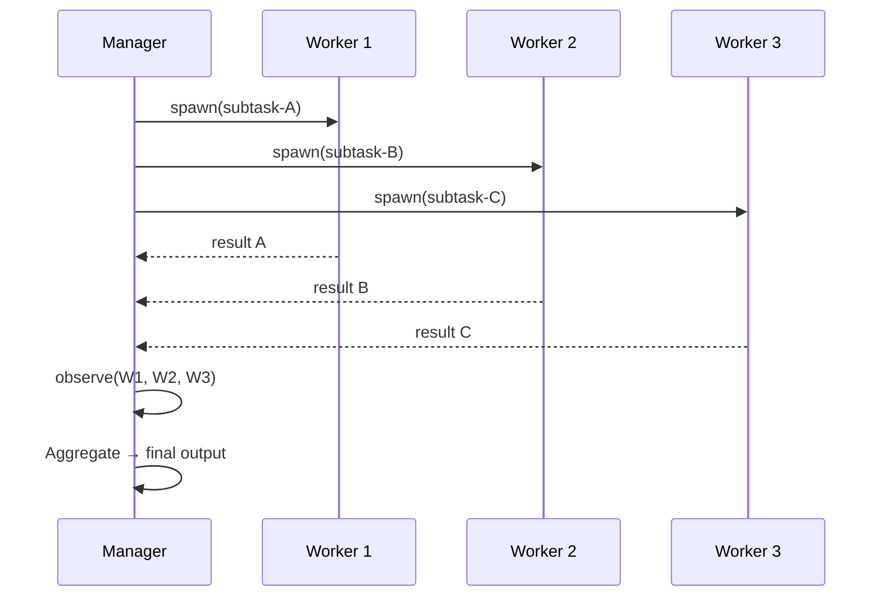
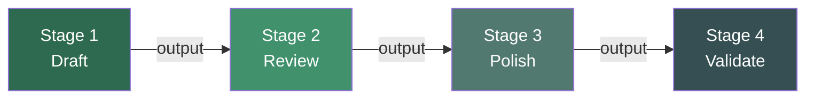
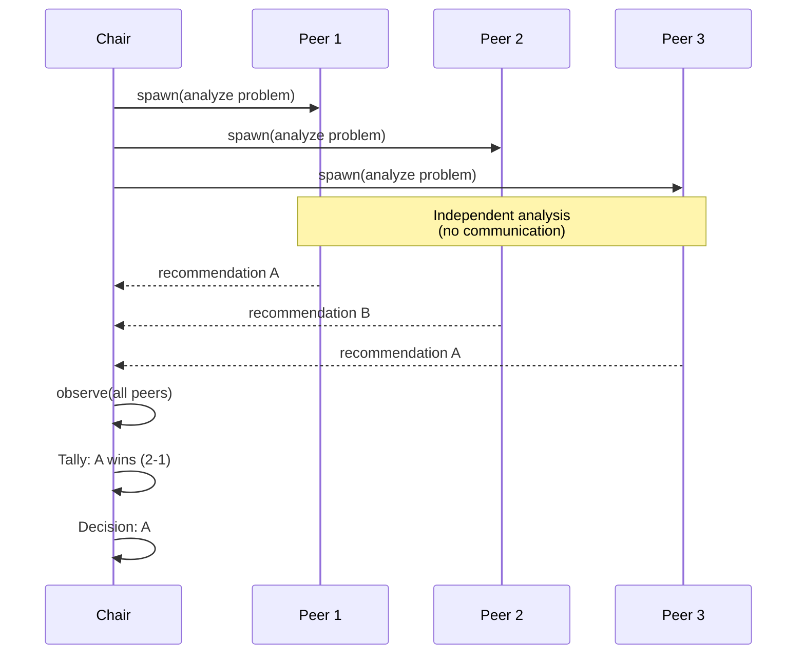
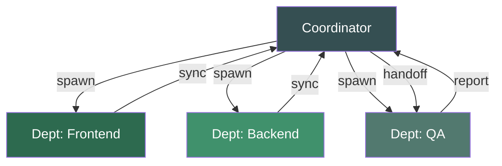
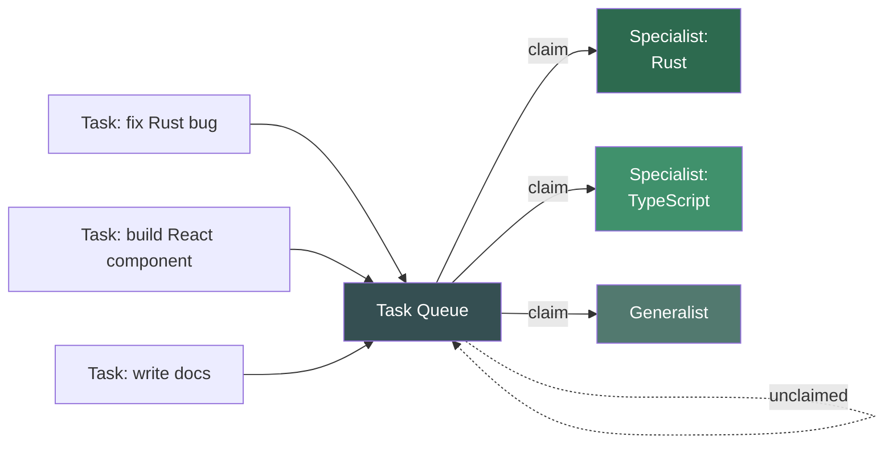
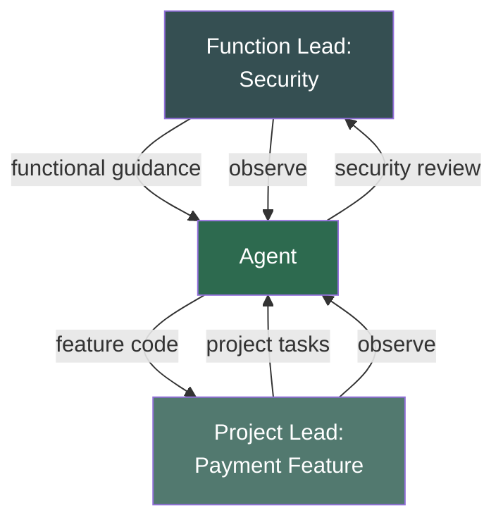

# Organizational Coordination Primitives — Deep Dive

## Overview

Deep-dive reference for the six **organizational coordination primitives** (Category A) defined in spec 019. These patterns map to coordination structures humans already understand — hierarchy, pipelines, committees, departments, marketplaces, and matrices. They are the starting point for teams transitioning from human-only workflows to agent fleets.

Category A primitives are **not deprecated** by the AI-native primitives (025–029). Many real workflows are best served by a pipeline or committee. These patterns use only `spawn` and `observe` — they don't exploit agent-specific properties like forking or merging, but they remain the right choice when the problem *is* structured like a human org.

## Design

### Summary

| Pattern | Operations | Structure | Best for |
| --- | --- | --- | --- |
| Hierarchical | spawn, observe | Manager delegates to workers | Clear authority, well-scoped subtasks |
| Pipeline | spawn | Sequential stages, output → input | Work with natural order |
| Committee | spawn, observe | Peers deliberate, vote on outcome | Decisions needing diverse perspectives |
| Departmental | spawn, observe | Functional groups, cross-group sync | Domain-boundary decomposition |
| Marketplace | spawn | Tasks posted, agents bid/claim | Heterogeneous capabilities, load balancing |
| Matrix | spawn, observe | Dual reporting — function + project | Cross-cutting responsibilities |

---

### Primitive 1: Hierarchical

**Structure:** A manager agent delegates sub-tasks to worker agents, observes their results, and aggregates them into a coherent output.



**When to use:**
- Clear authority structure — one agent understands the full problem and can decompose it
- Well-scoped subtasks with minimal inter-dependency
- Results roll up naturally (e.g., generate components separately, assemble into page)

**Configuration surface:**

```yaml
fleet:
  hierarchical:
    <name>:
      manager: <agent-id>
      workers:
        - id: worker-1
          task: "Implement authentication module"
        - id: worker-2
          task: "Implement data layer"
        - id: worker-3
          task: "Implement API routes"
      aggregation: concatenate          # concatenate | synthesize | select-best
      max_workers: 10
```

**Failure modes:**

| Failure | Symptom | Mitigation |
| --- | --- | --- |
| Manager bottleneck | Manager can't decompose fast enough for workers | Limit worker count; pre-plan decomposition |
| Scope overlap | Workers produce conflicting artifacts | Clearer task scoping; add scope isolation |
| Roll-up mismatch | Aggregated results are incoherent | Use synthesize aggregation instead of concatenate |

**Key difference from fractal decomposition:** In hierarchy, the manager is a *different* agent from the workers — it briefs them, and information is lost at the handoff. In fractal decomposition, the children ARE the parent (forked copies with full context). Use hierarchy when the manager's job is genuinely different from the workers' jobs.

---

### Primitive 2: Pipeline

**Structure:** Sequential stages where the output of one stage becomes the input for the next. Each stage is an independent agent.



**When to use:**
- Work has a natural sequential order (draft → review → polish → ship)
- Each stage is independently replaceable
- No feedback loops needed (output flows one direction)

**Configuration surface:**

```yaml
fleet:
  pipeline:
    <name>:
      stages:
        - id: drafter
          agent: <agent-id>
          input: "raw requirements"
        - id: reviewer
          agent: <agent-id>
          input: "from:drafter"
        - id: polisher
          agent: <agent-id>
          input: "from:reviewer"
        - id: validator
          agent: <agent-id>
          input: "from:polisher"
      error_strategy: halt               # halt | skip | retry
```

**Failure modes:**

| Failure | Symptom | Mitigation |
| --- | --- | --- |
| Stage failure cascading | One failed stage poisons all downstream | Error strategy: halt or retry |
| Sequential bottleneck | Total time = sum of all stages | Parallelize independent stages where possible |
| Context loss | Downstream stages lose upstream reasoning | Pass full context chain, not just final output |

**Key difference from stigmergic:** Pipeline has predefined stage order. Stigmergic has no predefined order — agents react to artifact changes autonomously. Use pipeline when the sequence is known and fixed.

---

### Primitive 3: Committee

**Structure:** Peer agents independently analyze the same problem, then vote or deliberate to reach a decision. A chair agent tallies results.



**When to use:**
- Decisions benefit from diverse perspectives
- No single agent has sufficient context or expertise alone
- The answer space is enumerable (vote-able)

**Configuration surface:**

```yaml
fleet:
  committee:
    <name>:
      chair: <agent-id>
      peers:
        - id: peer-1
          agent: <agent-id>
          perspective: "security-focused"
        - id: peer-2
          agent: <agent-id>
          perspective: "performance-focused"
        - id: peer-3
          agent: <agent-id>
          perspective: "usability-focused"
      decision: majority-vote            # majority-vote | unanimous | weighted | chair-decides
      min_peers: 3
      allow_deliberation: false          # Whether peers can see each other's votes
```

**Decision strategies:**

| Strategy | Behavior | When to use |
| --- | --- | --- |
| `majority-vote` | Most popular answer wins | Default — simple and fast |
| `unanimous` | All peers must agree; otherwise escalate | High-stakes decisions |
| `weighted` | Votes weighted by peer expertise scores | When peers have unequal domain authority |
| `chair-decides` | Chair uses peer input as advisory only | When accountability requires single decision-maker |

**Failure modes:**

| Failure | Symptom | Mitigation |
| --- | --- | --- |
| Tie vote | No majority on any option | Chair breaks tie; or add another peer |
| Groupthink | All peers converge on same flawed answer | Assign deliberately diverse perspectives |
| Irrelevant expertise | Peers lack domain knowledge for the question | Match peer selection to problem domain |

**Key difference from speculative swarm:** Committee votes on *one* answer from the options presented. Swarm *fuses fragments* from multiple branches into a novel composite. Use committee when you need a decision, swarm when you need a creative synthesis.

---

### Primitive 4: Departmental

**Structure:** Functional groups work in parallel on domain-specific pieces, with cross-group sync points coordinated by a central coordinator.



**When to use:**
- Problem splits along clear domain boundaries (frontend/backend, legal/engineering)
- Each department's work is largely independent but needs sync points
- Different specializations required per domain

**Configuration surface:**

```yaml
fleet:
  departmental:
    <name>:
      coordinator: <agent-id>
      departments:
        - id: frontend
          agent: <agent-id>
          domain: "UI components, styling, client state"
        - id: backend
          agent: <agent-id>
          domain: "API endpoints, database, business logic"
        - id: qa
          agent: <agent-id>
          domain: "Testing, validation, acceptance criteria"
      sync_points:
        - after: [frontend, backend]
          before: [qa]
          type: interface-alignment      # Verify API contracts match
```

**Failure modes:**

| Failure | Symptom | Mitigation |
| --- | --- | --- |
| Interface mismatch | Departments produce incompatible outputs | Sync point with interface-alignment checks |
| Coordinator overload | Too many departments to coordinate | Limit department count; use hierarchical sub-coordinators |
| Silo effect | Departments optimize locally, miss global concerns | Cross-department observers at sync points |

**Key difference from context mesh:** Departmental routing gates knowledge through a coordinator. Context mesh makes all knowledge visible to all agents simultaneously. Use departmental when domain boundaries are crisp and information should be scoped.

---

### Primitive 5: Marketplace

**Structure:** Tasks are posted to a shared queue. Agents with matching capabilities bid or claim tasks. No central assignment — agents self-select based on their specialization.



**When to use:**
- Heterogeneous agent capabilities — different agents are good at different things
- Dynamic task volume — tasks arrive unpredictably
- Load balancing across a pool of specialists

**Configuration surface:**

```yaml
fleet:
  marketplace:
    <name>:
      task_queue:
        max_size: 100
        priority: fifo                   # fifo | priority-score | deadline
      agents:
        - id: rust-specialist
          capabilities: ["rust", "systems", "performance"]
          max_concurrent: 3
        - id: ts-specialist
          capabilities: ["typescript", "react", "frontend"]
          max_concurrent: 3
        - id: generalist
          capabilities: ["*"]
          max_concurrent: 5
      claim_strategy: best-match         # best-match | first-available | auction
      unclaimed_timeout: 60s             # Re-post unclaimed tasks
```

**Claim strategies:**

| Strategy | Behavior | When to use |
| --- | --- | --- |
| `best-match` | Task assigned to agent with highest capability overlap | Default — quality-focused |
| `first-available` | First idle agent claims the task | When speed matters more than specialization |
| `auction` | Agents bid with estimated effort; lowest bid wins | When cost optimization is primary |

**Failure modes:**

| Failure | Symptom | Mitigation |
| --- | --- | --- |
| Starvation | Some tasks never claimed (niche requirements) | Generalist fallback agent; unclaimed timeout with re-routing |
| Overload | Popular agents take too many tasks | max_concurrent cap per agent |
| Mismatched claims | Agent claims task outside its capability | Capability matching enforcement before claim |

---

### Primitive 6: Matrix

**Structure:** Agents serve dual reporting lines — a functional specialty AND a project goal. This enables cross-cutting concerns where the same agent contributes to both its function's standards and its project's deliverables.



**When to use:**
- Agents have a functional expertise (security, performance, UX) that applies across projects
- Multiple projects need the same specialist perspective
- Cross-cutting quality standards must be maintained across project boundaries

**Configuration surface:**

```yaml
fleet:
  matrix:
    <name>:
      functions:
        - id: security-function
          lead: <agent-id>
          standards: ["OWASP top 10", "input validation", "auth checks"]
        - id: performance-function
          lead: <agent-id>
          standards: ["latency SLOs", "memory budgets"]
      projects:
        - id: payment-feature
          lead: <agent-id>
          agents: [security-1, perf-1]
        - id: onboarding-feature
          lead: <agent-id>
          agents: [security-2, perf-2]
      conflict_resolution: function-wins  # function-wins | project-wins | escalate
```

**Failure modes:**

| Failure | Symptom | Mitigation |
| --- | --- | --- |
| Dual-priority conflict | Function says "fix this vulnerability" but project says "ship the feature" | Explicit conflict_resolution policy |
| Agent overload | Agent pulled in too many directions | Limit matrix assignments per agent |
| Accountability gap | Neither lead owns the agent's output fully | Clear RACI-style responsibility for each artifact |

---

### Cross-primitive composition with Category B

Category A primitives compose naturally with AI-native primitives from specs 025–029:

| Outer (Category A) → Inner (Category B) | Why it works |
| --- | --- |
| Pipeline → Speculative swarm | Each pipeline stage is swarmed for exploration |
| Hierarchical → Generative-adversarial | Manager assigns adversarial hardening to each worker's output |
| Committee → Context mesh | Peers share a knowledge mesh to inform their votes |
| Departmental → Fractal decomposition | Each department fractal-decomposes its domain |
| Marketplace → Stigmergic | Claimed tasks trigger stigmergic artifact reactions |

| Outer (Category B) → Inner (Category A) | Why it works |
| --- | --- |
| Fractal decomposition → Committee | Each fractal child deliberates via committee for its scoped piece |
| Speculative swarm → Pipeline | Each swarm branch runs through a quality pipeline before merge |
| Stigmergic → Hierarchical | An artifact change triggers a hierarchical sub-team to respond |

## Plan

- [x] Document all 6 organizational primitives with lifecycle diagrams
- [x] Define configuration surface for each
- [x] Document failure modes and mitigations for each
- [x] Explain key differences from AI-native counterparts
- [x] Document cross-category composition patterns

## Test

- [ ] Every primitive uses only {spawn, observe} — matching spec 019 Category A definition
- [ ] Config surface fields are consistent across all 6 primitives
- [ ] Each primitive documents when to use and when NOT to use (via key difference callouts)
- [ ] Cross-category composition table covers all reasonable A→B and B→A pairs