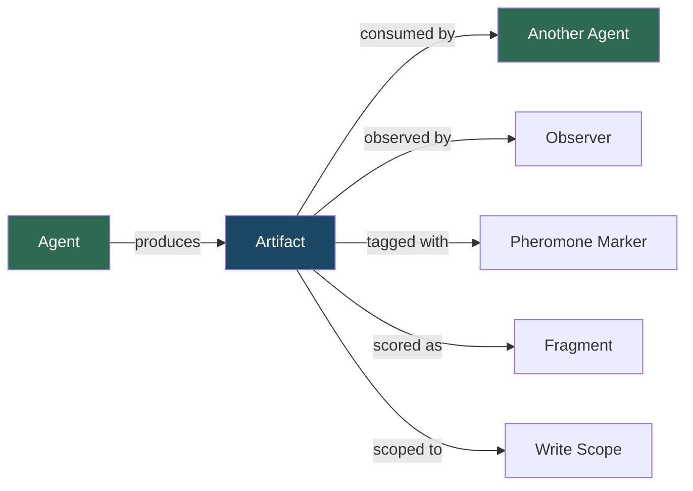
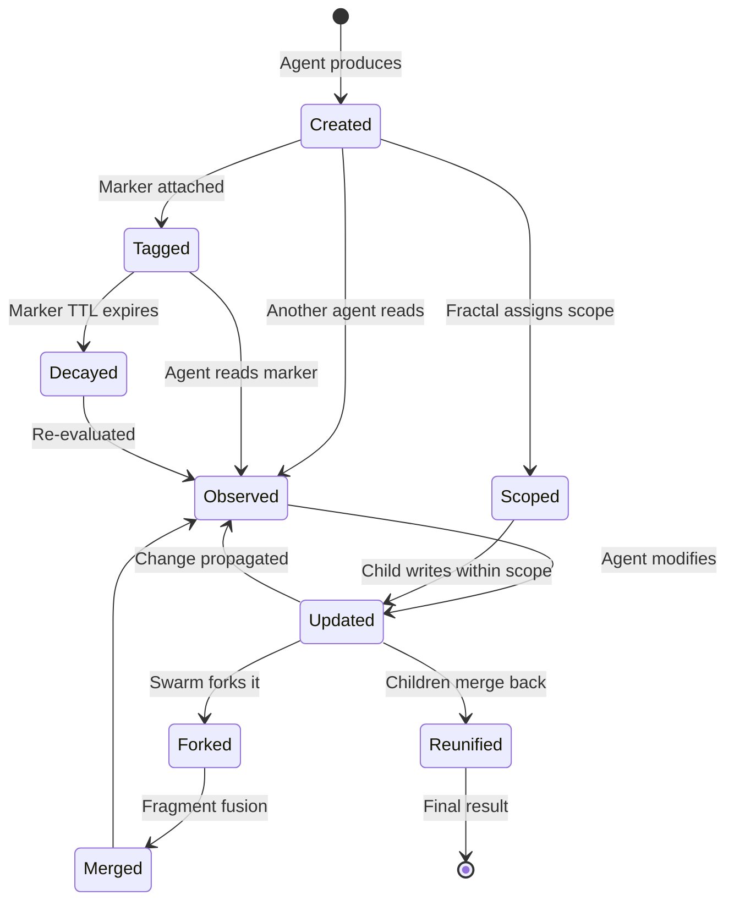

# Coordination Artifacts — Definition, Lifecycle & Roles

## Overview

Every coordination primitive produces, consumes, or reacts to **artifacts**. Yet the term "artifact" appears dozens of times across specs 019–030 without a formal definition. This spec fills that gap — defining what an artifact *is* in the coordination model, how it flows through operations, what properties it carries, and how different primitives interact with it.

An artifact is not just "the output of an agent." It's the **unit of observable, addressable, versionable state** that coordination primitives operate on. Understanding artifacts is essential because:

- **Merge** (swarm, fractal, mesh) requires decomposing artifacts into scoreable fragments
- **Observe** (all primitives) reads artifact state — not agent internals
- **Stigmergic coordination** is built entirely on artifact mutations as communication
- **Scope isolation** (fractal) is enforced by restricting which artifacts an agent can write
- **Convergence detection** (swarm) measures similarity *between artifacts*, not between agents
- **Pheromone markers** (stigmergic) are metadata *on* artifacts

## Design

### What is an artifact?

An artifact is any discrete, addressable, observable unit of work product within a coordination session. It is the **medium through which agents communicate, coordinate, and produce value**.



### Artifact properties

Every artifact in the coordination model has these properties:

```
Artifact {
    id: string                    # Unique identifier (path, URI, or content-hash)
    kind: ArtifactKind            # What type of content this is
    content: bytes                # The actual payload
    version: u64                  # Monotonically increasing revision number
    author: agent_id              # Which agent produced this version
    parent_version: Option<u64>   # Previous version (None for initial creation)
    scope: string                 # Hierarchical scope path (for isolation)
    created_at: timestamp         # When this version was produced
    metadata: Map<string, any>    # Extensible key-value pairs
}
```

### Artifact kinds

Artifacts fall into concrete categories. The coordination model is kind-agnostic — primitives operate on artifacts regardless of kind — but implementations need a taxonomy:

| Kind | Examples | Typical primitives |
| --- | --- | --- |
| `code` | Source files, functions, modules | Swarm (fork strategies), adversarial (hardening), fractal (scoped writes), stigmergic (reactive testing) |
| `document` | Specs, design docs, READMEs | Pipeline (draft→review→polish), committee (deliberate on content) |
| `config` | YAML configs, JSON schemas, env files | Mesh (knowledge claims), hierarchical (aggregated config) |
| `test` | Test files, test results, coverage reports | Adversarial (critic generates tests), stigmergic (reactive test generation) |
| `decision` | Architecture decisions, trade-off analyses | Committee (voting output), mesh (knowledge claim) |
| `plan` | Task decompositions, playbook selections | Fractal (split plan), hierarchical (delegation plan) |
| `data` | Datasets, embeddings, model outputs | Swarm (divergent processing), pipeline (transformation chain) |
| `trace` | Execution logs, reasoning traces | Cost model (nemosis teacher traces for distillation) |

### How each primitive uses artifacts

Artifacts play different roles depending on the coordination primitive:

```mermaid
flowchart TD
    ART[Artifact]

    subgraph Swarm["Speculative Swarm"]
        SF[Forked input] --> SE[Divergent outputs] --> SM[Fragment-fused result]
    end

    subgraph Mesh["Context Mesh"]
        MN[Knowledge claim node] --> MG[Gap = missing node] --> MF[Filled node]
    end

    subgraph Fractal["Fractal Decomposition"]
        FP[Parent artifact] --> FC[Scoped child artifacts] --> FR[Reunified artifact]
    end

    subgraph Adversarial["Generative-Adversarial"]
        AV1[Artifact v1] --> AV2[Artifact v2] --> AVN[Artifact vN]
    end

    subgraph Stigmergic["Stigmergic"]
        SW[Watched artifact] --> SR[Reactive artifact] --> SM2[Marker-tagged artifact]
    end

    ART --> Swarm
    ART --> Mesh
    ART --> Fractal
    ART --> Adversarial
    ART --> Stigmergic

    style ART fill:#1b4965,color:#fff
```



#### In speculative swarm (spec 025)
- **Input artifact:** Forked to N branches, each receiving a copy
- **Branch artifacts:** Divergent outputs produced by each strategy
- **Fragments:** Sub-units of branch artifacts that can be individually scored and selected
- **Fused artifact:** The merge result — composed of best fragments from surviving branches

Artifacts must be **fragment-decomposable** for fragment-fusion to work. This means the artifact has internal structure (sections, functions, paragraphs) that can be independently evaluated. Atomic artifacts (a single number, a binary blob) should use winner-take-all merge instead.

#### In context mesh (spec 026)
- **Knowledge claim:** An artifact that asserts a fact, design decision, or finding
- **Gap:** The absence of an expected artifact — detected via dependency edges
- **Filled node:** An artifact that resolves a gap, triggering reactive propagation

In the mesh, artifacts are the DAG nodes. Their `metadata` carries confidence scores and dependency lists. The artifact's `id` is its hierarchical key (e.g., `findings.auth.tokens`).

#### In fractal decomposition (spec 027)
- **Parent artifact:** The original work product being decomposed
- **Scoped child artifacts:** Portions of the parent's scope, each writable only by its assigned child agent
- **Reunified artifact:** The merged result of all children's scoped contributions

Scope isolation is enforced at the artifact level: `artifact.scope` must match the child agent's declared scope for writes to be accepted.

#### In generative-adversarial (spec 028)
- **Versioned artifact:** The generator produces artifact v1, critic attacks it, generator produces v2, etc.
- **Each version is a complete artifact** — not a patch or diff. The critic observes the full artifact each round.
- **Test artifacts:** The critic may produce test cases (themselves artifacts) that become part of the quality evidence.

The artifact's `version` and `parent_version` form a linear chain: v1 → v2 → … → vN.

#### In stigmergic coordination (spec 029)
- **Watched artifact:** An artifact matching an agent's watch pattern — changes trigger observation
- **Reactive artifact:** A new artifact produced in response to observing a change
- **Marker-tagged artifact:** An artifact with pheromone markers (needs-review, needs-fix, approved) in its `metadata`

Stigmergic artifacts are the communication channel itself. Agents never send messages — they write artifacts and observe other agents' artifacts.

#### In organizational primitives (spec 030)
- **Delegated artifact:** Manager assigns artifact production to a worker (hierarchical)
- **Stage artifact:** Output of one pipeline stage, input to the next
- **Voted artifact:** Candidate artifacts that peers evaluate (committee)

### Artifact versioning

All coordination artifacts are versioned. The version model is simple and linear per artifact:

```
v1 (created by Agent A)
 └── v2 (created by Agent A, after critic feedback)
      └── v3 (created by Agent A, after second round)
```

**Branching versions** occur only in speculative swarm, where a single artifact is forked into N branches:

```
v1 (parent)
 ├── branch-1/v1 (fork with strategy A)
 │    └── branch-1/v2
 ├── branch-2/v1 (fork with strategy B)
 │    └── branch-2/v2
 └── branch-3/v1 (fork with strategy C)

→ merge → v2 (fused from branch-1/v2.section_a + branch-3/v1.section_b)
```

### Fragment model

Fragments are the sub-units of an artifact used during merge operations (primarily in speculative swarm). Not all artifacts are fragment-decomposable.

```
Fragment {
    artifact_id: string           # Parent artifact
    fragment_id: string           # Unique within the artifact
    content: bytes                # The fragment payload
    score: f64                    # Quality score (0.0–1.0)
    scorer: string                # What scored this fragment
    boundaries: (start, end)      # Position within the parent artifact
}
```

**Fragment scoring** is domain-specific:
- Code fragments: correctness (tests pass), complexity (cyclomatic), coverage
- Document fragments: coherence, completeness, accuracy
- Config fragments: validity (schema conformance), security (no secrets exposed)

### Artifact addressing

Artifacts need stable, addressable identifiers for observation, scoping, and dependency tracking:

| Context | Addressing scheme | Example |
| --- | --- | --- |
| File-based coordination | Filesystem paths | `src/auth.rs`, `tests/auth_test.rs` |
| Knowledge mesh | Hierarchical keys | `findings.auth.tokens`, `design.api.routes` |
| Stigmergic watch patterns | Glob patterns | `src/**/*.rs`, `audit/**` |
| Fractal scoping | Scope prefixes | `scope:authentication`, `scope:data-layer` |
| Swarm branches | Branch-qualified paths | `branch-1/solution.rs`, `branch-3/solution.rs` |

### Artifact lifecycle



**States:**
- **Created** — initial production by an agent
- **Observed** — read by at least one other agent (or the coordination system)
- **Tagged** — pheromone marker attached (stigmergic)
- **Updated** — new version produced (adversarial, iterative refinement)
- **Forked** — copied to multiple branches (swarm)
- **Scoped** — write-restricted to a specific agent (fractal)
- **Merged** — fragments from branches fused into a single artifact
- **Reunified** — scoped children's artifacts merged back to parent
- **Decayed** — markers expired, artifact may need re-evaluation

### Relationship between artifacts and operations

Every operation in the model (spec 019) interacts with artifacts:

| Operation | Artifact role |
| --- | --- |
| `spawn` | New agent receives initial artifacts as context |
| `fork` | Parent agent's artifacts are copied to each child (with divergent context) |
| `merge` | Multiple agents' artifacts are combined into one (via fragment-fusion, winner-take-all, or weighted-blend) |
| `observe` | Agent reads another agent's artifacts (not the agent's internal state — the observable output) |
| `convergence` | Measures similarity between artifacts across branches |
| `prune` | Discards an agent AND its artifacts (or marks them as abandoned) |

This is a key clarification: **observe reads artifacts, not agent internals.** An agent's "state" as visible to the coordination model IS its artifacts. Internal reasoning, chain-of-thought, and working memory are not observable — only the produced artifacts are.

## Plan

- [x] Define what an artifact is in the coordination model
- [x] Define artifact properties and schema
- [x] Define artifact kinds taxonomy
- [x] Document per-primitive artifact roles
- [x] Define versioning model (linear and branching)
- [x] Define fragment model for merge operations
- [x] Define artifact addressing schemes
- [x] Document artifact lifecycle state machine
- [x] Clarify relationship between artifacts and the 6 operations

## Test

- [ ] Every primitive (025–030) has its artifact interaction pattern documented
- [ ] Artifact properties cover all fields referenced across sibling specs
- [ ] Fragment model supports all three merge strategies (fragment-fusion, winner-take-all, weighted-blend)
- [ ] Artifact addressing works for all five contexts (file, mesh, stigmergic, fractal, swarm)
- [ ] The observe-reads-artifacts clarification is consistent with spec 019's operation signatures