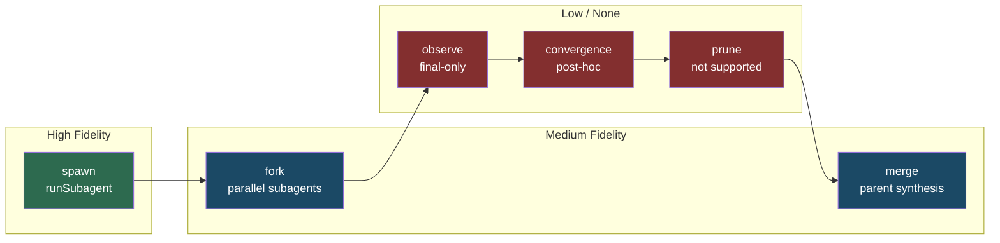
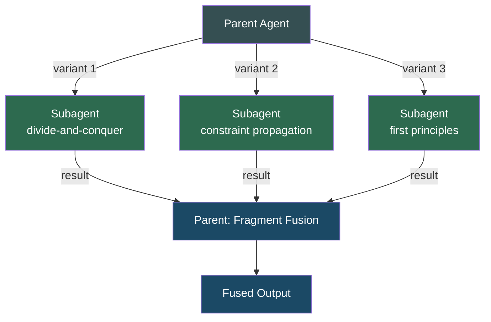
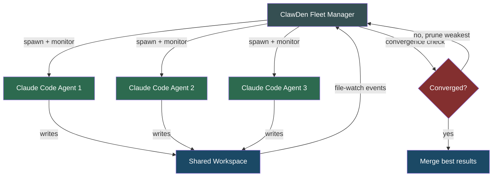

# Claude Code Coordination Implementation — Mapping AI-Native Primitives to Agentic Coding Workflows

> **Status**: planned · **Priority**: high · **Created**: 2026-03-10

## Overview

Defines how **Claude Code** (Anthropic's agentic coding tool) implements the coordination model from spec 017/019. Where spec 013 maps the theory to ClawDen's Rust runtime, this spec maps it to Claude Code's native orchestration capabilities: subagent spawning, tool-use parallelism, session management, and multi-file editing workflows.

Claude Code already exhibits several coordination primitives implicitly — this spec makes those patterns explicit, identifies which spec-017 operations map cleanly, which require adaptation, and which represent gaps that ClawDen must bridge when orchestrating Claude Code agents in a fleet.

## Design

### Operation Mapping

The six abstract operations from spec 019 map to Claude Code capabilities as follows:

| Operation     | Spec 019 Signature                            | Claude Code Mapping                                                                                             | Fidelity |
| ------------- | --------------------------------------------- | --------------------------------------------------------------------------------------------------------------- | -------- |
| `spawn`       | `(template, context) → agent_id`              | `runSubagent(prompt, agentName)` — creates a stateless child agent with full prompt context                      | High     |
| `fork`        | `(agent_id, variants) → [agent_id]`           | Multiple parallel `runSubagent` calls with variant prompts — each gets independent context but shared workspace  | Medium   |
| `merge`       | `(agent_ids, strategy) → agent_id`            | Parent agent synthesizes subagent results in its own context — manual fragment fusion                            | Medium   |
| `observe`     | `(agent_id) → agent_state`                    | Subagent returns final message only; no mid-execution state inspection. Workspace artifacts are observable.      | Low      |
| `convergence` | `(agent_ids, threshold) → convergence_result` | No native support — must be implemented via artifact comparison after subagent completion                        | Low      |
| `prune`       | `(agent_ids, criterion) → [pruned_ids]`       | No native support — subagents run to completion. Early termination requires timeout or task scoping.             | None     |



### Key Architectural Constraints

Claude Code operates under constraints that differ from a custom Rust runtime:

1. **Stateless subagents** — each `runSubagent` call is independent. No persistent agent identity across invocations. The parent must carry all coordination state.
2. **No mid-execution observation** — subagents return a single final message. The parent cannot inspect intermediate state, limiting real-time convergence detection.
3. **Shared workspace as coordination surface** — all agents (parent + subagents) read/write the same filesystem. This naturally enables stigmergic coordination but requires conflict management for concurrent writes.
4. **Sequential subagent execution** — subagents do not run in parallel with each other (each `runSubagent` blocks). Parallel tool calls (file reads, searches) are supported within a single agent.
5. **Token budget as resource constraint** — the cost model maps to context window and API token limits rather than agent-count or compute-time budgets.

### Primitive Implementation Strategies

#### Category A: Organizational Primitives (Full Support)

Claude Code naturally supports all six organizational primitives from spec 019:

| Primitive    | Claude Code Implementation                                                                                    |
| ------------ | ------------------------------------------------------------------------------------------------------------- |
| Hierarchical | Parent agent delegates subtasks to typed subagents (Explore, code-gen, test-runner)                           |
| Pipeline     | Sequential subagent calls where each receives the prior's output in its prompt                                |
| Committee    | Multiple subagents analyze the same input; parent synthesizes diverse perspectives                            |
| Departmental | Subagents scoped to domain areas (frontend, backend, tests) with parent handling cross-domain sync            |
| Marketplace  | Parent assesses task requirements and dispatches to the most appropriate named agent                           |
| Matrix       | Subagent receives dual-scoped prompt (functional specialty + project context)                                 |

#### Category B: AI-Native Primitives (Partial Support)

**Speculative Swarm — Adapted**

Claude Code cannot run agents in true parallel, but can simulate swarm behavior sequentially:

1. Parent formulates N variant prompts (strategy divergence)
2. Runs N subagents sequentially, each with a different strategy
3. Collects all results and performs fragment fusion in parent context
4. No mid-execution cross-pollination (constraint: stateless subagents)
5. No convergence-based pruning (all branches run to completion)

The sequential execution eliminates the cost advantage of early pruning but preserves the diversity-and-fusion benefit. For latency-sensitive scenarios, ClawDen fleet orchestration (spec 013) should be used instead.



**Context Mesh — Natural Fit**

The shared workspace filesystem IS a context mesh. Claude Code agents already:
- Read artifacts produced by other agents (file reads)
- Produce artifacts that other agents consume (file writes)
- Detect knowledge gaps via semantic search returning no results
- Resolve conflicts via read-before-write patterns

The gap: no reactive propagation (agent B isn't notified when agent A writes a file). The parent must explicitly orchestrate information flow by reading updated files and passing relevant context to subsequent subagents.

**Fractal Decomposition — Natural Fit**

Claude Code's `runSubagent` directly models fractal decomposition:
1. Parent agent analyzes task complexity
2. Spawns scoped subagents for orthogonal sub-problems
3. Each subagent inherits workspace context (full file access)
4. Subagents can recursively spawn their own subagents (depth-bounded by token budget)
5. Results reunify in parent via file artifacts + returned messages

This is Claude Code's strongest primitive — the agent naturally decomposes complex tasks into subtask agents.

**Generative-Adversarial — Supported**

Implementable as a loop in the parent agent:
1. Spawn generator subagent → produces artifact
2. Spawn critic subagent → reviews artifact, produces critique
3. Spawn generator subagent with critique context → produces improved artifact
4. Repeat until quality threshold or max rounds

The parent manages escalation by enriching the critic's prompt each round. No fatigue applies — each subagent is fresh. The constraint is token cost (each round consumes a full subagent invocation).

**Stigmergic — Partial (Orchestrator Required)**

Claude Code's workspace is a natural pheromone surface, but without event-driven reactivity:
- Agents can leave markers (TODO comments, status files, metadata)
- Agents can observe markers via grep/search
- No automatic triggering — the parent must poll or explicitly dispatch

For true stigmergic coordination, ClawDen's fleet layer (spec 013) provides the reactive artifact-watch mechanism that Claude Code alone cannot.

### ClawDen Integration Points

When Claude Code agents run inside a ClawDen fleet, the orchestration gaps are filled:

| Gap in Claude Code                | ClawDen Bridge                                                    |
| --------------------------------- | ----------------------------------------------------------------- |
| No parallel execution             | ClawDen spawns multiple Claude Code processes concurrently        |
| No mid-execution observation      | ClawDen monitors workspace artifacts as proxy state               |
| No convergence detection          | ClawDen compares outputs across parallel Claude Code agents       |
| No pruning                        | ClawDen terminates underperforming Claude Code processes          |
| No reactive notification          | ClawDen file-watcher triggers new Claude Code agent on changes    |
| No persistent agent identity      | ClawDen maintains agent registry with session continuity          |



### Cost Model Mapping

Spec 019's three-tier cost model maps to Claude Code as follows:

| Tier     | Spec 019 Role            | Claude Code Equivalent                                                  |
| -------- | ------------------------ | ----------------------------------------------------------------------- |
| Frontier | Novel reasoning, teacher | Claude Opus — complex architecture, design decisions, novel problem solving |
| Mid-tier | Balanced                 | Claude Sonnet — standard implementation, code review, test writing      |
| Student  | Distilled pattern replay | Claude Haiku — boilerplate generation, formatting, simple searches        |

ClawDen's `clawden.yaml` can specify model tier per agent role, enabling automatic cost optimization within fleet-managed Claude Code workflows.

### Coordination Patterns for Common Coding Tasks

| Task                    | Recommended Primitive      | Claude Code Implementation                                                                                   |
| ----------------------- | -------------------------- | ------------------------------------------------------------------------------------------------------------ |
| Large refactor          | Fractal decomposition      | Parent decomposes into per-module subagents; each handles its scope independently                            |
| Code review             | Generative-adversarial     | Generator subagent writes code; critic subagent attacks it in escalating rounds                              |
| Feature implementation  | Pipeline                   | Design subagent → implement subagent → test subagent → review subagent                                      |
| Bug investigation       | Context mesh (manual)      | Explore subagent gathers context; parent synthesizes findings; fix subagent applies solution                 |
| Multi-approach solving  | Speculative swarm (serial) | N subagents try different approaches sequentially; parent fuses best fragments                               |
| Cross-cutting concerns  | Departmental               | Separate subagents for security, performance, accessibility; parent integrates across concerns               |
| Continuous improvement  | Stigmergic (poll-based)    | Agents leave TODO/FIXME markers; periodic sweep subagent detects and addresses them                          |

## Plan

- [ ] Validate operation mapping against spec 019 formal definitions
- [ ] Define `clawden.yaml` schema extensions for Claude Code agent configuration
- [ ] Implement fractal decomposition orchestration in ClawDen CLI
- [ ] Implement generative-adversarial loop orchestration
- [ ] Implement serial speculative swarm with fragment fusion
- [ ] Build convergence detection for parallel Claude Code fleet execution
- [ ] Document anti-patterns specific to Claude Code coordination

## Test

- [ ] Each spec 019 operation has a documented Claude Code mapping or explicit gap declaration
- [ ] All 11 primitives have implementation strategies or ClawDen-bridge documentation
- [ ] Coding task table covers the 7 most common agentic coding workflows
- [ ] Cost model tiers map to specific Claude model variants
- [ ] Anti-pattern compositions from spec 019 are validated in Claude Code context

```bash
# Verify all 6 operations are mapped
python -c "
ops = ['spawn', 'fork', 'merge', 'observe', 'convergence', 'prune']
mapped = ['High', 'Medium', 'Medium', 'Low', 'Low', 'None']
assert len(ops) == len(mapped) == 6
for o, m in zip(ops, mapped):
    print(f'{o}: {m}')
print('OK: all 6 operations mapped')
"
```

| Assertion            | Deterministic check                           |
| -------------------- | --------------------------------------------- |
| `ops-mapped`         | All 6 operations have fidelity classification |
| `primitives-covered` | All 11 primitives have implementation section |
| `tiers-mapped`       | 3 cost tiers → 3 Claude model variants        |

## Notes

This spec intentionally focuses on what Claude Code can do **today** with its current `runSubagent` architecture. As Claude Code gains native parallel execution, persistent agent identity, or streaming observation capabilities, the fidelity ratings in the operation mapping table should be updated.

The boundary with spec 013: that spec owns the ClawDen Rust trait implementation of the coordination model. This spec owns the mapping of that model to Claude Code's agent runtime. When ClawDen manages Claude Code agents in a fleet, both specs apply — 013 provides the orchestration layer, this spec defines how each Claude Code agent executes its assigned primitive internally.
